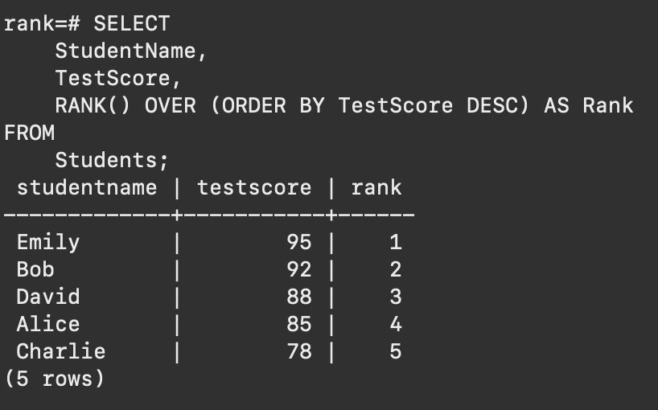
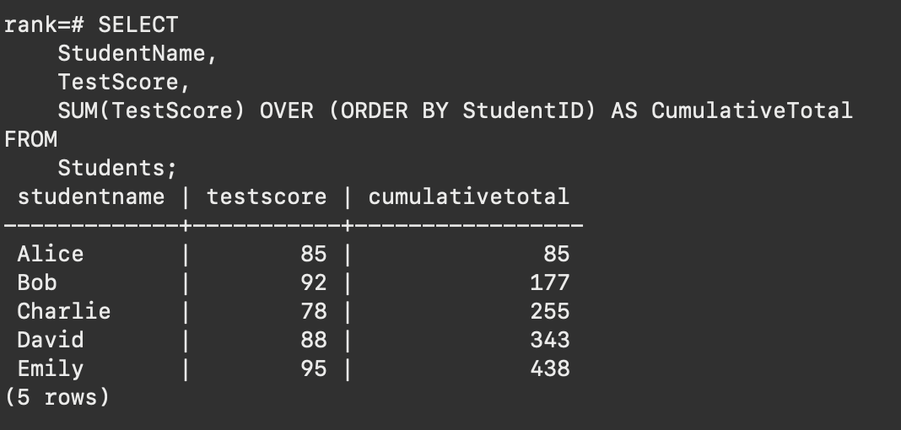
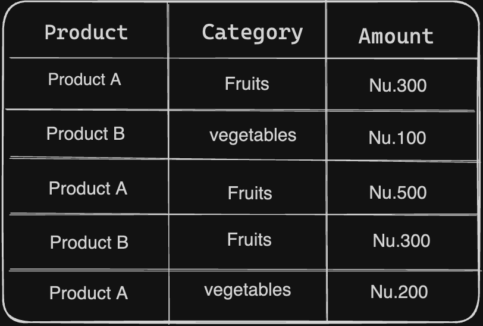
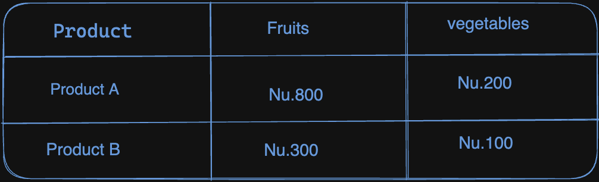
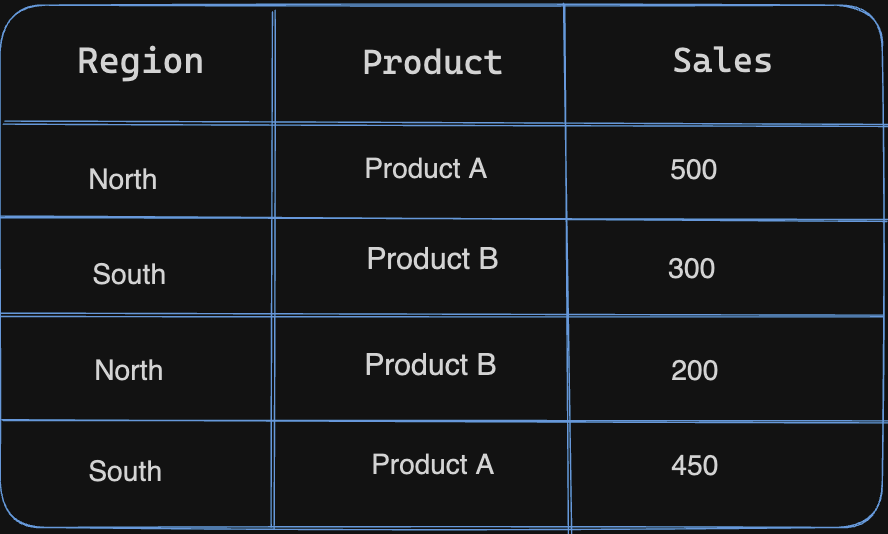

##  Advanced Aggregation Functions
### Summary of the class 
---
In this session we focussed on Advanced Aggregation Functions.Firstly Advanced aggregating functions are essentially supercharged data analysis tools; they go beyond basic counting or summing to provide deeper insights, such as identifying trends or outliers, creatively organizing data into groups, or even working with spatial or temporal data.So, we formed 4 groups of size with 6-7 students.Each group were given an invdividual topic of advanced aggregation techniques commonly used in database systems and data analysis. that are Ranking, Windowing, Pivoting, Rollup and Cube.

#### Ranking 
Ranking means assigning a position or order to items based on a particular characteristic.It helps in identifying the relative standing of each item within a group, making it easier to understand performance, prioritize, or identify top performers.
example:

#### Windowing
Windowing allows calculations to be performed over a specific subset of data, providing contextual analysis without considering the entire dataset at once, useful for tasks like calculating moving averages or identifying trends within a defined scope.

Example:
The query calculates the cumulative total of test scores for each student, ordered by their StudentID, showing the running sum of test scores up to each row. It utilizes the SUM() window function with an ORDER BY clause to achieve this.

#### Pivoting
PIVOT enables us to see rows as columns in a query result.
example:The table given below demonstrates pivoting, where Product A and B belong to categories of fruits and vegetables with different amounts. The next table shows the total amount of fruits and vegetables sold by Product A and B.
Table before pivoting

Table After pivoting

#### Rollup and Cube
Values may be aggregated on many axes to meet the demands of more thorough reporting, thanks to ROLLUP and CUBE. 

ROLLUP summarizes against a hierarchy of columns. example:

CUBE organizes the values into all possible combinations.
example:

* Grand Total Sales: 1450
* Subtotal for North: 700
* Subtotal for South: 750
* Subtotal for Product A: 950
* Subtotal for Product B: 500

### Feedback on Flipped Class 
---
The positive aspects of this flipped classroom are attributed to presentations, allowing us to enhance our learning experiences. However, there is a fear associated with presenting our topics to the class.