## HackTheBox
### Connecting to the HTB VPN 
Before starting the hack the box challanges i connected to the VPN of US server by downloading the VPN(.ovpn) configuration file and run it into the terminal.

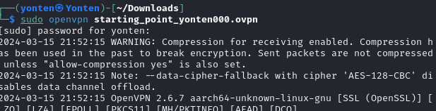

## Tire 0 
### MEOW 
#### Gaining Access to the System
Firstly I spawn the meow machine.

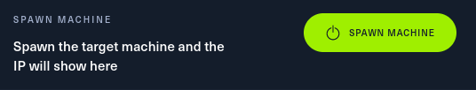

Then I got the target ip address.

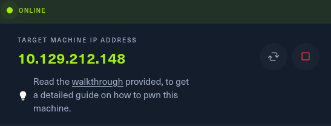

To test whether i am connected to the machine i ping the ip address.

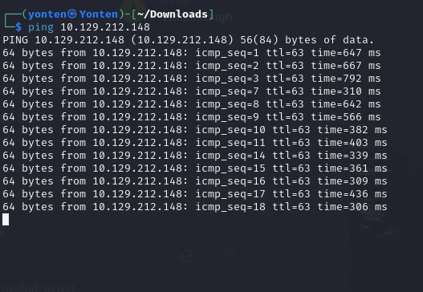

After that i scan the machine and found out service i was running was telnet.

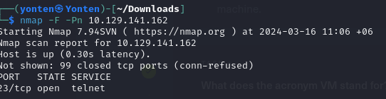

i log into the target over telnet with a blank password that is root and list what ae inside that file and thus got the root flag.

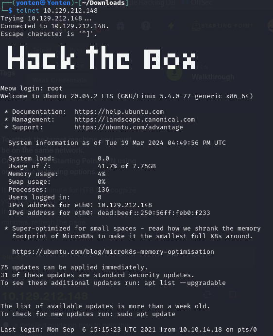
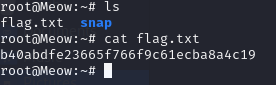

#### Learning Through the Meow Machine
New things learned in this machine are:
* nmap: it is a network scanning tool. 
* openvpn: it is the service that we used to form our vpn connection into HTB labs.
* ICMP echo request (Internet Control Message Protocol): it also known as ping messages.it is mostly used as a troubleshooting tool to see the connection between devices.
* telnet: Telnet is a very vulnerable service to run on any machine. It allows anonymous login sometimes, misconfigurations, and weak passwords.i found out service i was running on was telnet.
* root: it is the superuser account in unix and linux.It has the highest access rights on the system therefore it has the power to execute any command and modify any file. This makes it an necessary tool for system administrators for performing tasks that regular users cannot.

### FAWN
#### Gaining Access to the System
like before i spawn the machine, got the target ip address and ping the ip address to see if i can communicate with the machine.

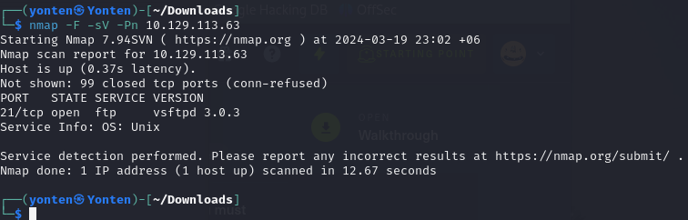

After that i scan the version of the machine running on using -sV.I also used the -F command this command can scan the machine faster by scanning few important parts.
In this machine key task was to login into the root user using anonymous username and a random password. then i logged in and list the files and download it and the submited the root flag.

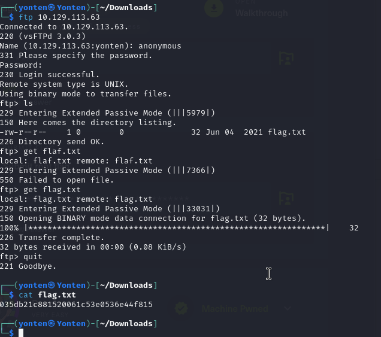

#### Learning Through the FAWN Machine
things learned in this machine are:
* FTP(file transfer protocol):it is a way to download, upload, and transfer files from one location to another on the Internet and between computer system.  
* Unix:It is a modular OS made up of a number of essential components, including the kernel, shell, file system and a core set of utilities or programs.
* get:it is a command to download package in linux.
* anonymous login:It allows us to log in anonymously. we don’t need to know the username or password of an existing user. This misconfiguration is a significant security flaw, as it grants unauthorized access to the FTP server's files. one key thing to learn in this machine was to login under anonymous user and all i did is download the file using get and exit the machine and used cat command to retrive the data.

### Dancing
#### Gaining Access to the System
like before i spawn the machine and got the target ip address of dancing machine.In my scan 3 ports are detected.The port 445/tcp is open and running on microsoft-ds which includes SMB functionality.

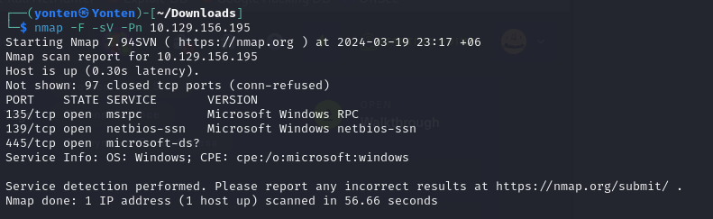

We used smblicient to exploit SMB service in this machine.i found 4 sharename.

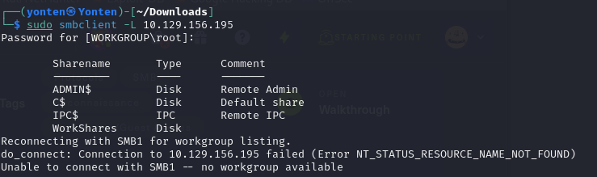

"workshares" is the only sharename containing file.

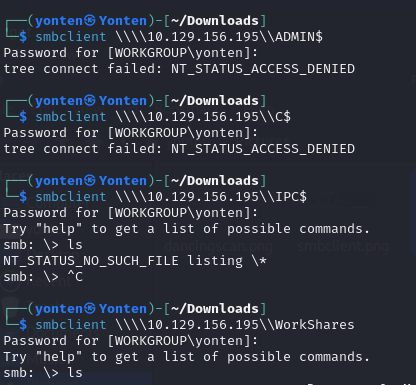

So, I tried navigating to the workspace and found out that there are 2 user directories, 'Amy.J' and 'James.P'.under user James.P i found a flag.txt file which i downloaded it using get and retrive it using cat got the root flag.

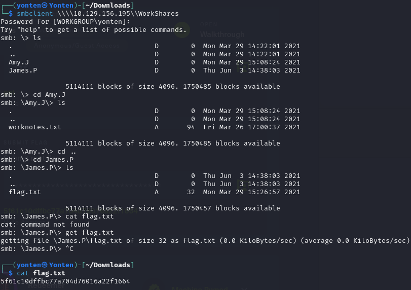

#### Learning Through the Dancing Machine
* SMB(server message block):it is a client-server communication protocol used for sharing access to files, printers, serial ports and other resources on a network.

### Redeemer
#### Gaining Access to the System
like usual I spawn machine,ping the ip address of the target machine.scan the virsion of the machine.
after the scan redis service is running on the 6379 port that is open on the machine.

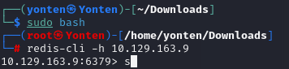

Then I connected to the Redis server using redis-cli -h command, but in here i first get into the root user. root user  is something has a high access over the the system.after getting the info about the redis server i came to know there are 4 keys i used get command and got the root flag.

#### Learning Through the Redeemer Machine
* Redis (Remote Dectionary Server) :is an open-source advanced NoSQL key-value data store used as a database. The data is stored in a dictionary format having key-value pairs.it is store in in-memory database unlike post posgres,My SQL,etc..

## Tire 1
### Appointment 
#### Gaining Access to the System
Firstly, I spawned the machine and obtained the target IP address. Then, I pinged the IP address and conducted a simple scan.I discovered that port 80 is open, and the version running on it is Apache httpd 2.4.38 (Debian). The standard port used for the HTTPS protocol is 443. I copied my IP address and pasted it into the browser, which navigated to a login page where the SQL injection vulnerability occurs.

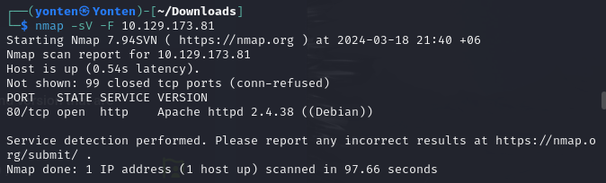

The SQL query is attempting to retrieve data from a table named "users" where the username is equal to the string "$username" and the password is equal to the string "$password123". Since it is a user-controlled application, we can manipulate the username and password. So, when I change the username from 'username' to 'admin#' it will automatically comment out the query. Thus, I entered 'admin#' as the username and typed anything for the password, thereby obtaining the root flag.

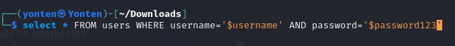
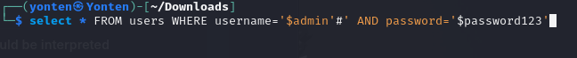

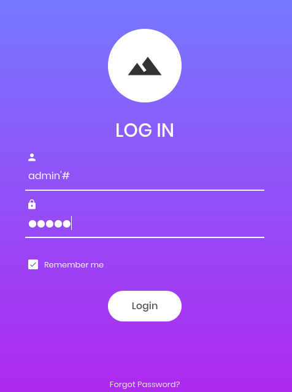
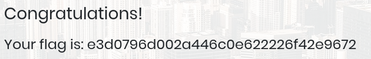

#### Learning Through the Appoinment Machine
* directory is called as folder in web-application termilogy.
* gobuster: a fast brute-force tool to discover hidden URLs, files, and directories within websites. This will help us to remove/secure hidden files and sensitive data.
* SQL injection, also known as SQLI, is a common attack vector that uses malicious SQL code for backend database manipulation to access information that was not intended to be displayed.

### Sequel
#### Gaining Access to the System
I Spawn the sequel machine, ping the the ip address like before, and scaned the target ip address.The port 3306 is open and it is serving MySQL and MariaDB is the version on the community-developed MySQL.

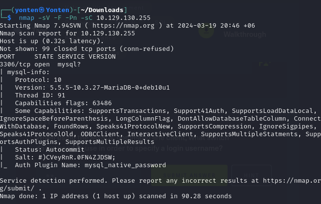

Then i get into the MariaDB database 

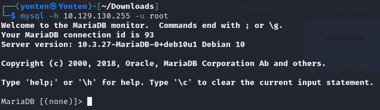

At moment,the database is set to none.So I list the database and there are 4  database.I  logged in into 'htb'. Under that there is two tables.that is 'config' and 'user' 

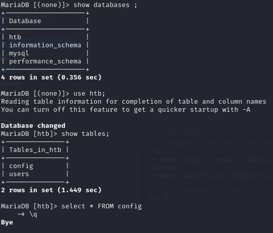

i displayed everything inside the config table from which i got the root flag.

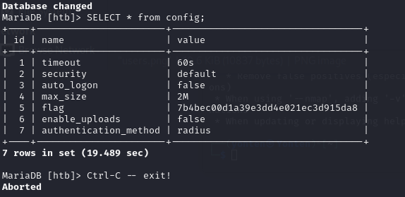

#### Learning Through the Sequel Machine
* 'mysql -h 10.129.130.255 -u root' This command attempts to connect to a MySQL database server located at the IP address 10.129.130.255 using the username "root".
* ' * ' - it is the symbol that is used to specify within the query that we want to display everything inside a table.

### Crocodile 
#### Gaining Access to the System
After I spawn the machine i got the ip address of the crocodile machine and again ping the machine.

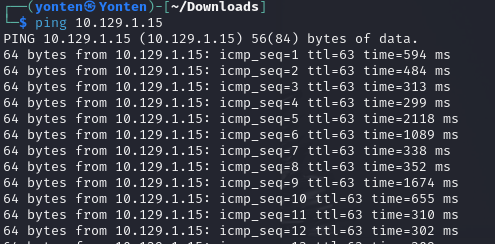

Then I did the necessary scan.Two ports are open that are vsftpd 3.0.3 and  Apache httpd 2.4.41.

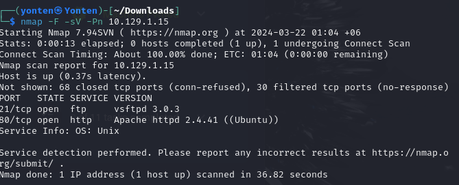

Then I login to the ftp server and download the files there.There is two file in there that are allowed.userlist and allowed.userlist.passwd.

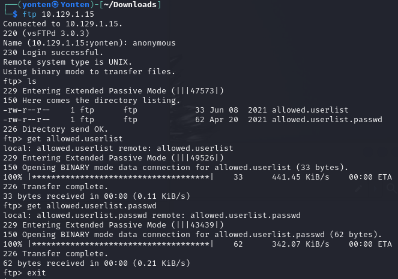

Inside that i saw a lists of username and password

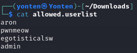

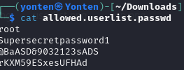

Then i run a directory scan using gobuster

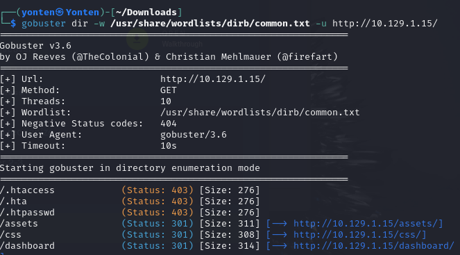

Then there is a /dashbord link where it will take us to a page where we have to enter a username and a password.

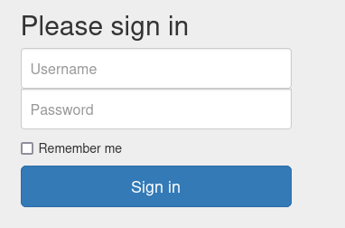

Then I used hydra to brute force the username and password in attempt to log in to the web application at m ip address using the login form at /login.php.Then i got my username and password.

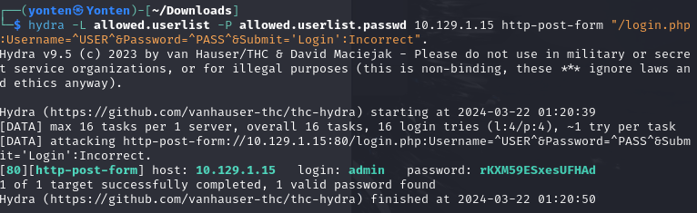

finally i got my root flag.

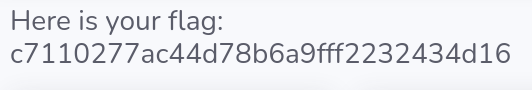

#### Learning Through the crocodile Machine
* gobuster:it is a powerful tool used for brute-forcing URIs (directories and files) in websites, DNS subdomains, virtual host names on target web servers, and more
* hydra:This command is designed to perform a brute-force attack on a web application's login form using HTTP POST requests.

