##  Normalization
### Summary of the class
In this Flipped Class journal, we aim to explore normalization and the different types of DBMS normal forms. Before delving into the specifics, it's crucial to discuss the objectives of this journal, which include acquiring the skills to apply normal forms for optimizing database designs and comprehending the importance of reducing databases to normal forms.

### Normalization
**Normalization** is a method used to structure data in database tables to reduce data redundancy. It involves breaking down a large dataset into smaller tables and establishing appropriate relationships between them.

## Types of normal form 
###  First Normal Form(1NF)
For a table to be in the First Normal Form:
* It should only have single(atomic) valued attributes/columns. 
* Values stored in a column should be of the same domain.
* All the columns in a table should have unique names.
* The order in which data is stored should not matter.

For example,

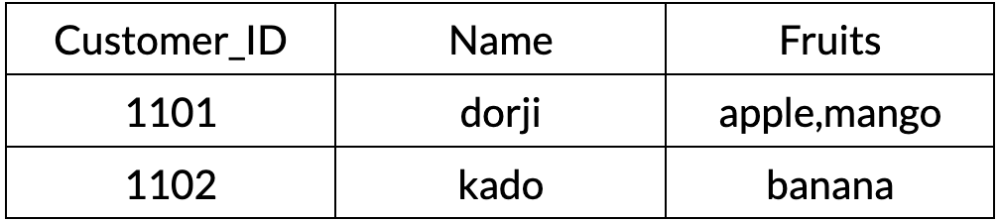

The table mentioned above does not meet the criteria for the First Normal Form. Despite containing distinct names and regardless of the order in which the data is stored, the columns maintain consistent values of the same type, such as all customer names. However, the issue arises from the "Fruits" column, which stores multiple comma-separated values. According to the First Normal Form, each column should hold only a single value.

So Inorder to pass the First Normal form, we have to create another column with a single value.

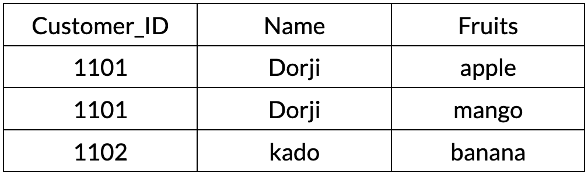

###  Second Normal Form(2NF)
For a table to be in the Second Normal Form:
* It should be in the First Normal form.
* It should not have Partial Dependency.

**Partial Dependency** occurs in a table when a non-primary key column depends on only a part of the composite primary key, which can lead to data organization challenges.

**Composite primary key** is a primary key composed of two or more columns in a database table, where the combination of these columns uniquely identifies each row in the table.

For example,

Both Customer_ID and Order_ID together form the primary key.There's a partial dependency because Customer_Address depends only on Customer_ID.

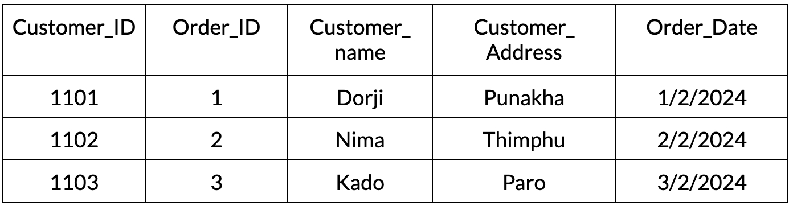

To achieve second normal form, we split the table into two separate tables: Customers and Orders, ensuring that non-key attributes depend on the entire primary key.

Customer;

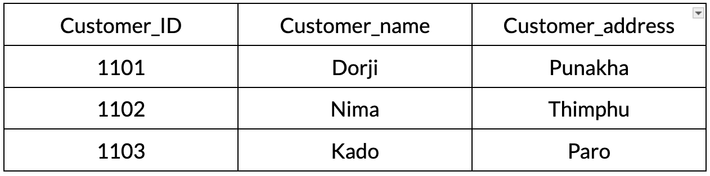 

Orders;

Now, Customer_Address depends on the entire primary key (Customer_ID) in the Customers table, fulfilling second normal form requirements. Each table represents a single entity, and there's no partial dependency.

###  Third Normal Form(3NF)
For a table to be in the Third Normal Form:
* It should satisfies the First Normal Form and the Second Normal form.
* it should not have Transitive Dependency.

**Transitive dependency** means a non-primary key column relies on another non-primary key column, creating redundancy and complicating data management.

For example;

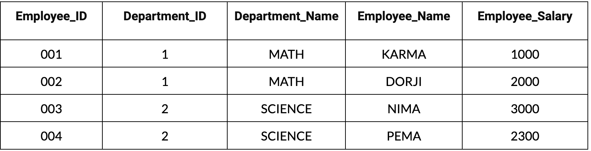

In above table the Employee_ID and Department_ID serve as the primary key, but Department_Name relies on Department_ID, not the primary key, creating a transitive dependency, violating 3NF.

To achieve 3NF, we further normalize the table by removing transitive dependencies.

Employees Table;

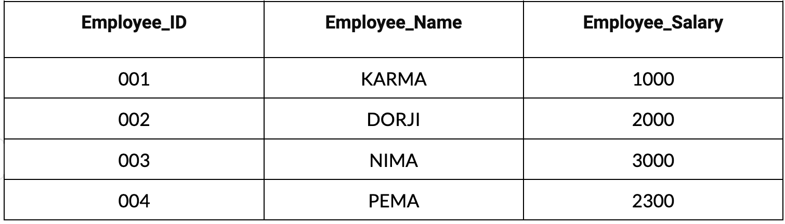

Departments Table;

By doing that Department_name depends solely on primary key that is Department_ID.Thus the table fulfills the third normal form's requirments.

### Boyce-Codd Normal Form(BCNF)
For a table to be in BCNF:
* It needs to follow 3NF's rules.
* Each relationship should have a key as its basis.
* No non-primary key column should depend on another non-primary key column, making sure each table stands alone and avoids unnecessary repetition.

For example;

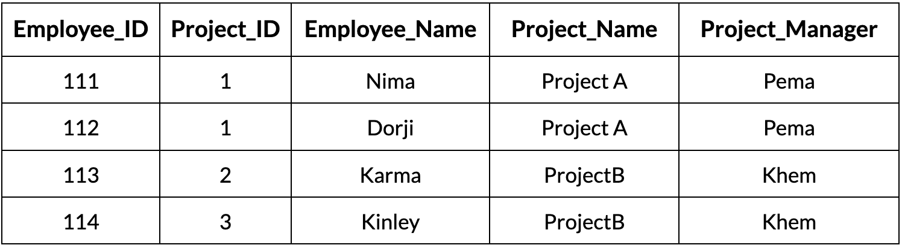

Both Employee_ID and Project_ID together form the primary key. There's a dependency where Project_Manager depends only on Project_ID, not on the whole primary key.

To achieve BCNF, we further normalize the table to ensure all attributes depend solely on the candidate keys.

Employees Table:

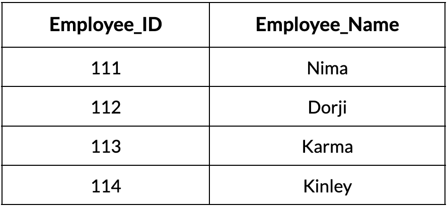

Projects Table:

Project_Managers Table:

Now, each table represents a separate entity, and there are no non-trivial dependencies on non-prime attributes, satisfying BCNF.

### Fourth Normal Form (4NF)
Imagine we have a table where a non-primary key column's value is determined not just by one other non-primary key column, but by a combination of several other non-primary key columns. In 4NF, we aim to avoid such situations, as they can lead to data redundancy and make the table more complicated than necessary.

For example;

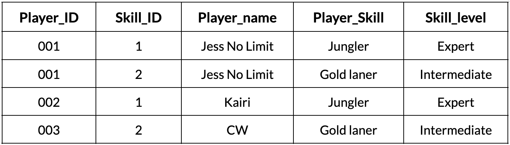

In this table Both player_ID and Skill_ID together form the primary key.
There's a multi-valued dependency where Skill_Level depends on combinations of player_ID and Skill_ID.

Players table

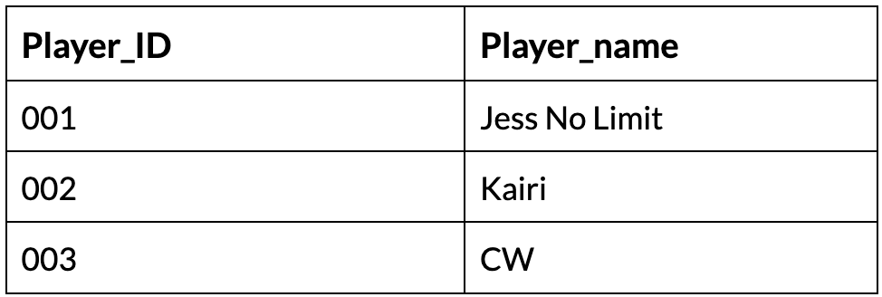

SkillS table

Player_skillS table 

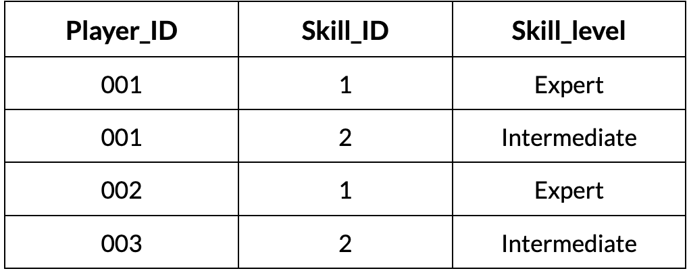

Now, each table represents a separate entity, and there are no multi-valued dependencies on non-prime attributes, satisfying 4NF.

