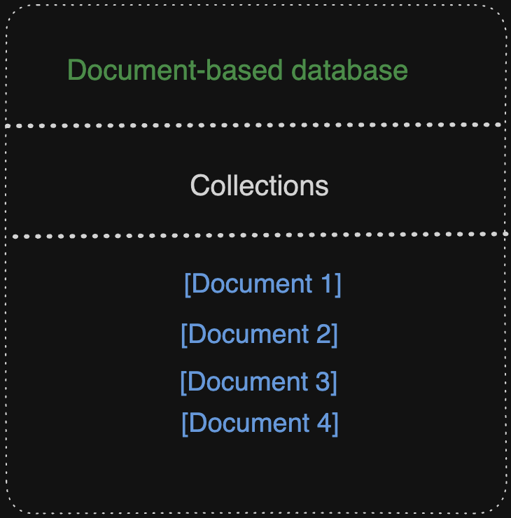
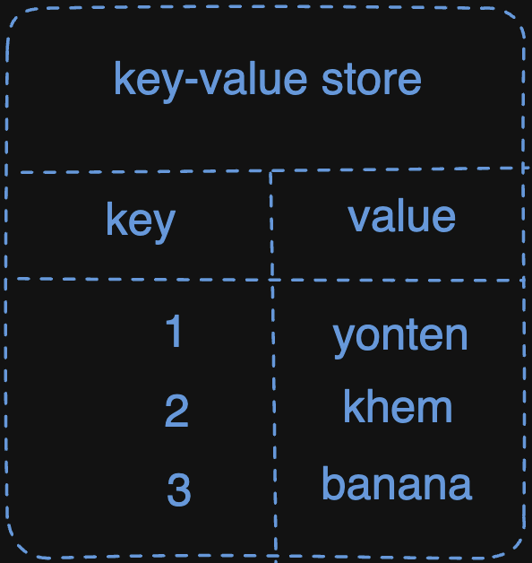
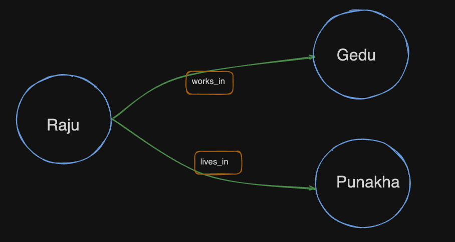
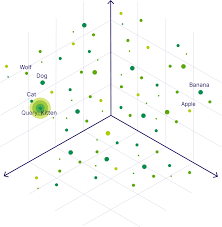
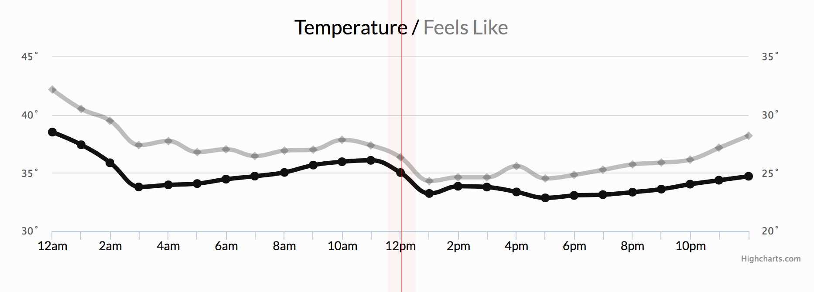
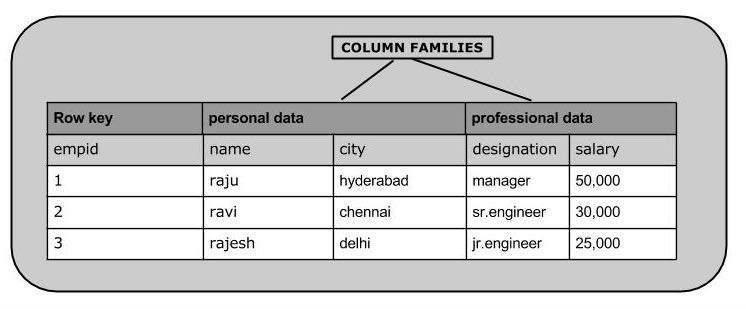

##  Nonrelational Database(NoSQL)
In this journal, we aim to explore types of Nonrelational Databases. Before delving into the specifics, it's crucial to discuss the objectives of this journal, which includes exploring different types of non-relational databases and understand the advantages and disadvantages of different types of non-relational databases.

**Nonrelational databases**, also known as NoSQL databases, work differently from traditional ones like SQL. Instead of requiring a fixed layout for data, they're more flexible, making them useful for managing unorganized or changing data. They're particularly handy for handling large amounts of information efficiently, especially when it's spread out across multiple locations.

### Types of Nonrelational Database
* Document based databases 
* Key-Value based databases 
* Graph Databases
* Vector Databases
* Time-series Databases
* Column oriented Databases

* ### Document based databases 
A document-based database stores data in documents such as JSON or XML rather than tables. Documents are organized into groups based on comparable content, and a flexible schema allows for different arrangements. Key characteristics include quicker document generation and maintenance, faster querying using index values, and the elimination of the requirement for foreign keys owing to independent document connections.

for example;

The diagram represents a document-based database, where data is organized into collections, each containing multiple documents. The main box labeled "Document-Based Database" symbolizes the entire database system. Within this box, the "Collections" section indicates that the database comprises multiple groups of documents. Each collection can hold various documents, denoted by entries such as "[Document 1]", "[Document 2]", etc. This structure showcases how data is grouped and organized within the database.

* ### Key-Value based databases(KVD) 
It is the simplest form of NoSQL databases. In this database every piece of data is stored as a key-value pair. Each piece of data has a unique key associated with it, making it easy to retrieve. 

for example;

Think KVD like a table with only two columns: one for the key and the other for the value. Keys are like the labels on file folders, and values are what's inside the folders.

* ### Graph Databases
A graph database is a NoSQL database that saves and displays data through graph structures. The nodes represent entities, whereas edges represent the relationships between them. This makes it useful for applications where the relationships between data points are just as essential as the data itself, such as social networks, recommendation systems, and network research.

for example;

"Raju", "gedu", and "punakha" are nodes.where it shows relationship like raju works in gedu and lives in punakha.

* ### Vector Databases
A vector database is similar to a well-organized file system for geographical data, such as maps and locations. It makes it easier to discover and analyze points, lines, and shapes on a map, which is useful for navigation apps, GIS, and mapping services.

for example; the diagram below is a representation of how the vector datatabse typically looks like, it consists of structured tables containing spatial data, such as points, lines, and polygons. Each table holds attributes of these objects, like coordinates and names.

* ### Time-series Databases
A time series database is like a special notebook that keeps track of events as they happen, organizing them by time. It's great for things like tracking sensor data, stock prices over time, or even your daily step count.

for example; the following diagram is a time series of temperature over time usually depicted as a line graph, with time on the x-axis and temperature on the y-axis. Each point on the line represents a temperature measurement at a specific time.

* ### Column oriented Databases
A column-oriented database is like organizing information by columns rather than rows, making it faster for certain types of data analysis, like finding averages or totals for specific categories.

for example; the following diagram is a column-oriented database because in here the data is organized by columns rather than rows. Each column holds values for a specific attribute, allowing for efficient analysis of individual attributes across multiple records
