## Pickle Rick

https://tryhackme.com/r/room/picklerick 

**HELLO guys!**
This is a ctf journal on pickle rick and i will be guiding you guys how to do this machine step by steps.

First don't forget to turn on the machine.

### Exploring the website
After I got my target ip Address and I browse that on my browser and I got this.

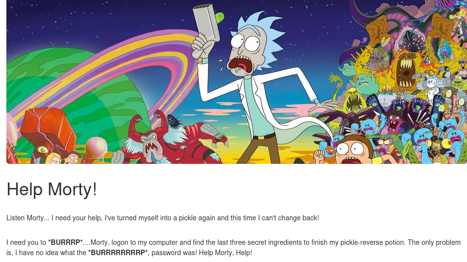

I inspect the page and got the username that is 'R1ckRul3s'

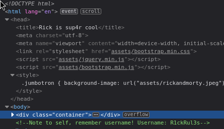

### Brute-forcing directories and files from the website
I brute force the ip adddress using **gobuster** and got a bunch of sites.

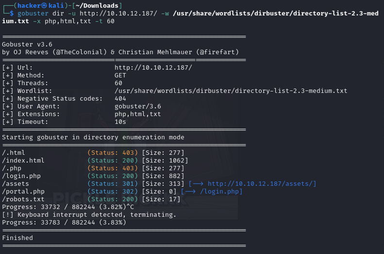

First I have checked the assets site and I have found a bunch of other files which were not important for me so I haven't focus on that much.

In login.php I have got a login site.

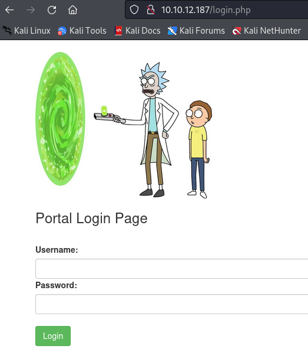

In robots.txt site I have found a password 'Wubbalubbadubdub' 

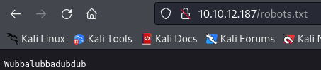

#### Trying the username and password on login page 
Now I will try login the page using the following username and password that I have got.
**Username**

    R1ckRul3s

**Password**

    Wubbalubbadubdub

By di=oing that I have got a command panel site.

Now I have tried the 'ls' command to list the file in there which I have found lists of files.ohh! one of them says 'Sup3rS3cretPickl3Ingred.txt' did I just get the  first ingredient.

I have used 'cat' command to retrieve the data but the command was disabled.

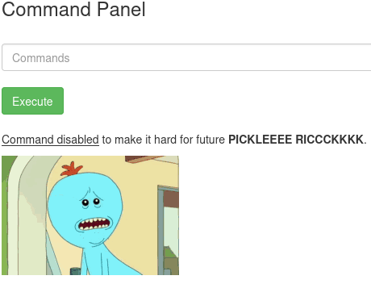

### Reverse shell
Now I have decided to pop open a reverse shell by executing a reverse shell script into the command section.

#### pentest monkey
I have used the pentest monkey python code to create a reverse shell because it is  comprehensive, ready-to-use scripts and cheat sheets that streamline and simplify penetration testing tasks.

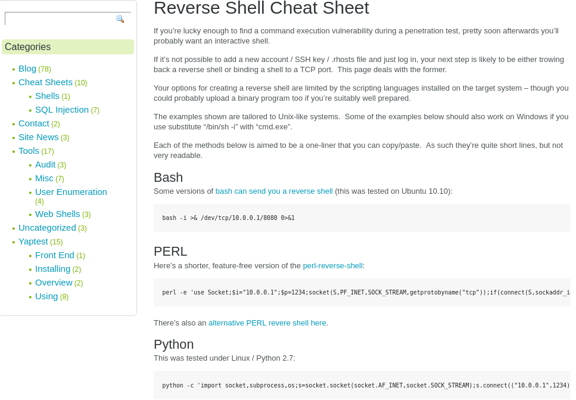

Then use netcat to listen on my terminal 

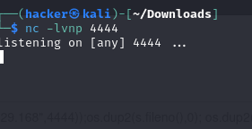

Now I have access to the machine.

#### first ingredient 

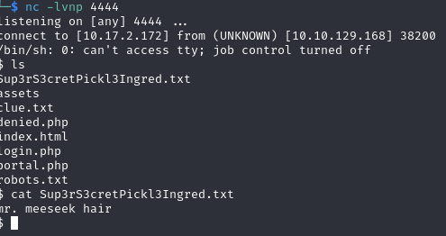

#### second ingredient

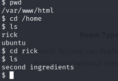 
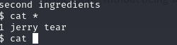

#### Third ingredient

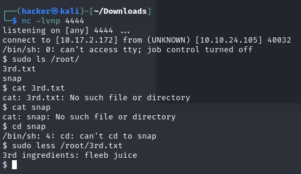