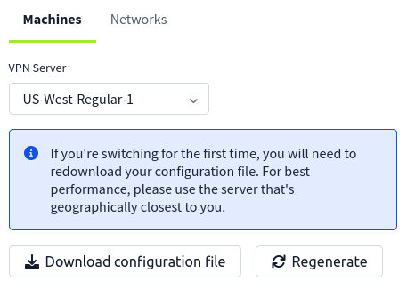

## OWASP Top 10 - 2021

Firstly before entering the room download the vpn

Then connected to the vpn

After that spawn the machine and get the target ip address.

  

### Topics you will learn in this room 
---
1. Broken Access Control
2. Cryptographic Failures    
3. Injection
4. Insecure Design
5. Security Misconfiguration    
6. Vulnerable and Outdated Components
7. Identification and Authentication Failures
8. Software and Data Integrity Failures
9. Security Logging & Monitoring Failures
10. Server-Side Request Forgery (SSRF)

### Broken Access Control
* **Broken access control** vulnerability is a security flaw that allows unauthorized users to access, modify, or delete data they shouldn't have access to.

If the application doesn’t verify the user’s access rights before serving the requested data, it’s vulnerable to a broken access control attack.

**Impact of BAC** :
* Data breaches: Unauthorized access to sensitive information.
* Financial loss: Direct monetary impact and legal costs.
* Reputation damage: Loss of trust and diminished brand value.

**Insecure Direct Object Reference**

Insecure Direct Object Reference (IDOR) in a computer system is like a library where books are stored in a locked room. Each book has a number, but some numbers are secret and should only be seen by certain people. If you figure out those secret numbers, you can access books you're not supposed to. 

In this room we were given a small demonstration on how IDOR works.Firstly we paste the ip address in a browser, where it will direct us to page where we enter login username and password which was given, we just have to get the flag.   

the first things in the id=1 is not a flag so i changed the id till 5 where I got a hint to try lower than going further.

So, I tried id=0 and got the flag.

### Cryptographic Failures 
I can send messages to my friend, and only him and I can see those messages; this is called encryption, and no one other than him and I can see those messages.

Cryptography safeguards information by concealing it in a manner that ensures only authorized recipients can decipher it. If this safeguard fails, attackers could potentially gain unauthorized access to sensitive information, thereby acquiring full control over it.

If cryptography filure occurs attackers can  easily decrypt my message between me and my friend leading to a significant security risk.

### Injection
**SQL injection** occur when a attacker 
SQL injection is a hacking technique where attackers manipulate input fields to execute unauthorized SQL commands on a database, potentially gaining access to sensitive information.

**Command injection** is when hackers trick a program into running their own commands on the computer it's running on. They do this by sneaking in their own instructions through parts of the program that aren't properly protected. This lets them control the computer and do things they're not supposed to, like stealing data or taking over the system.

### Insecure Design
**Insecure design** is a flaws in the application's construction, creating opportunities for hackers to exploit and compromise its security.

### Security Misconfiguration
Security misconfigurations happen when security settings are set up incorrectly, leaving your systems open to attacks. This can occur due to poorly documented changes, default settings, or technical issues, putting your data and systems at risk.

 
### Vulnerable and Outdated Components
Vulnerable and Outdated components are software or applicationare that are outdated and contain bugs that are public to all, that is- sites like https://www.exploit-db.com contain the full detail as to how to exploit the bugs to put the security of the whole website under severe threat.

### Identification and Authentication Failures

**Identification and authentication** failures are security vulnerabilities where a system fails to correctly identify or authenticate a user, potentially allowing attackers to gain unauthorized access. 

This can happen due to weak credentials,like in above diagram user using weak username and password making it easier for attackers to exploit, or when the application fails to accurately verify user identities. Additionally, if session cookies contain predictable values, attackers can manipulate these to access user accounts.

* we can prevent this by setting strong password,Implement Multi-factor Authentication (MFA), and by Managing Sessions Securely.

