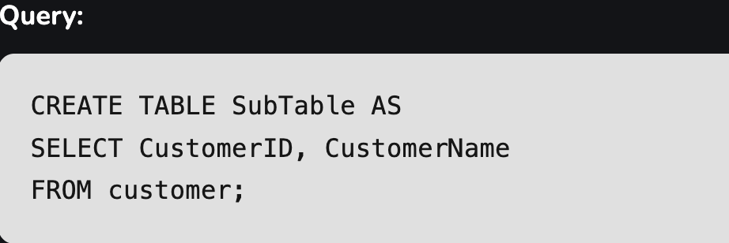
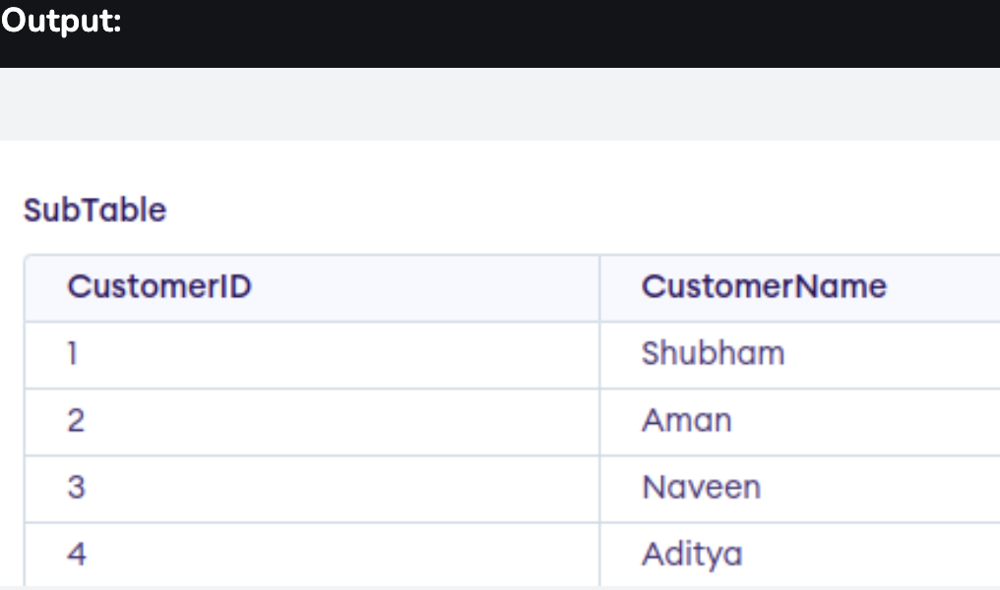
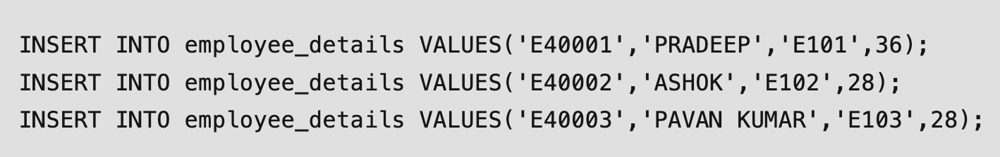
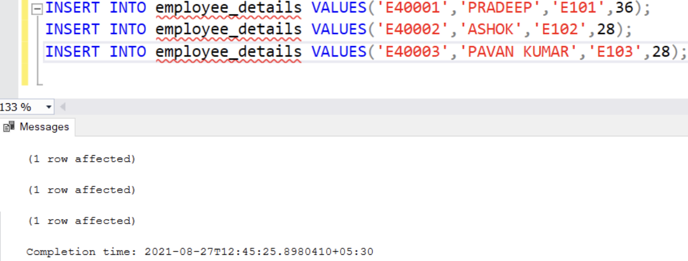
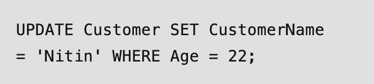
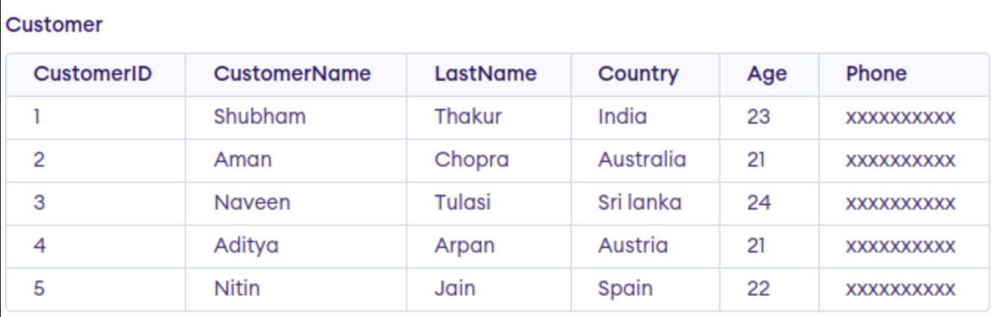
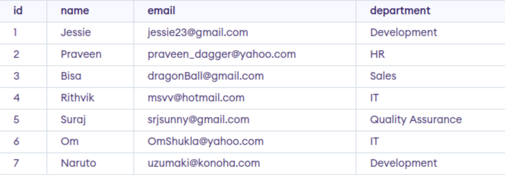
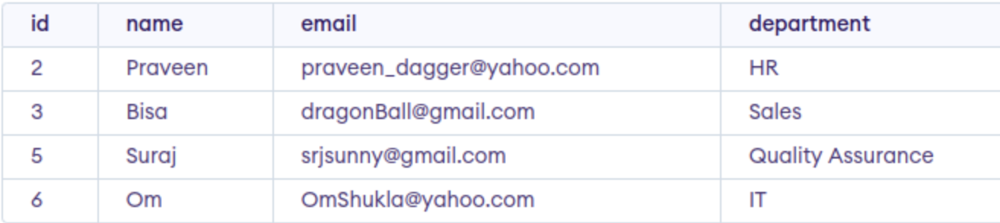

### Creating a database from scratch
---
Today I this journal we were give some article and note down some of the important procedures for building a relational database from scratch.before that I would like to briefly expalin about database.
A database is an organized collection of structured data stored and accessed electronically. It is made so that large amounts of data can be quickly retrieved, added, or deleted.

### Important procedures for building a relational database from scratch
#### 1. Define Database Schema
To create a database firstly we need to define the schema of our database which includes defining table,column,relationships,entities.

#### 2. Create Tables
A Table is a combination of rows and columns. For creating a table we have to define the structure of a table by adding names to columns and providing data type and size of data to be stored in columns.

  

#### 3. Insert Records
Insertion in a table is a DML (Data manipulation language) operation in SQL. When we want to store data we need to insert the data into the database. We use the INSERT statement to insert the data into the database. 

Query;

 

Output;

#### 4. Update Records
The UPDATE statement in SQL is used to update the data of an existing table in the database. We can update single columns as well as multiple columns using the UPDATE statement as per our requirement.

Updating single column query;
 

Output;

#### 5. Delete Records
SQL DELETE is a basic SQL operation used to delete data in a database. SQL DELETE is an important part of database management DELETE can be used to selectively remove records from a database table based on certain conditions. This SQL DELETE operation is important for database size management, data accuracy, and integrity.

Eg. If this is the table and i want to delete the development column. 

 

Deleting development column query;

Output ;

This are the some common and important procedures that we need to have for building a relational database from scratch.having this can effectively design and implement a relational database system that meets the requirements of their applications while ensuring data integrity, consistency, and performance.

