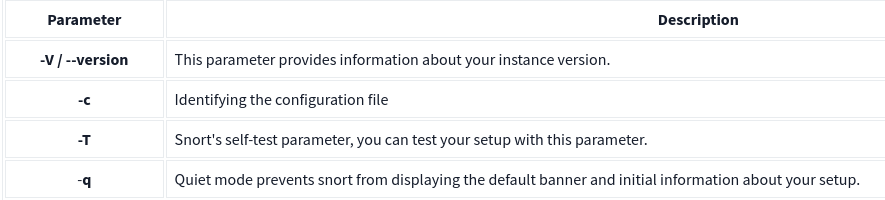

**Snort** is a leading open-source Intrusion Prevention System (IPS) worldwide. It uses rules to identify malicious network activity, generating alerts when it detects matching packets.

### Interactive Material and VM
I deployed the machine and open split view. 
 
 

After splitting the view I have opened the task exercise folder.

  

Then inside the folder I opened terminal.

Inside the terminal I ran this command 

    ./.easy.sh  

And found the ouput ' Too Easy! '

### Intrusion Detection System (IDS)
IDS watches for bad stuff happening on the network and sends alerts when it finds something suspicious.

#### There are two tpes of IDS:
1. Network Intrusion Detection System (NIDS):  Watches network traffic across the whole subnet, aiming to spot threats. Alerts if it finds a signature.

2. Host-based Intrusion Detection System (HIDS): Monitors traffic on a single device to catch threats. Alerts when it detects a signature.

### Intrusion Prevention System (IPS)
It actively monitors and protects networks from malicious activities by blocking or preventing unauthorized access, abnormal behavior, and security threats in real-time.

####  There are four main types of IPS systems:
- Network Intrusion Prevention System (NIPS)
- Behaviour-based Intrusion Prevention System (Network Behaviour Analysis - NBA)
- Wireless Intrusion Prevention System (WIPS)
- Host-based Intrusion Prevention System (HIPS) 

### Detection/Prevention Techniques

### First Interaction with SNORT 
Use the following command to verify snort is installed or not

    snort -V

we should ensure our configuration file is valid.for that we use "-T" for testing configuration, and "-c" for identifying the configuration file (snort.conf). 

    sudo snort -c /etc/snort/snort.conf -T 

Following image is some common parameter used in snort

It runs Snort in verbose mode, providing detailed output.

    sudo snort -v

It runs Snort in packet dump mode, displaying packet data.

    sudo snort -d

It runs Snort in packet dump mode with extra data, providing additional information.

    sudo snort -de

It runs Snort in packet dump mode with extra data and payloads, showing payload content.

    sudo snort -X

