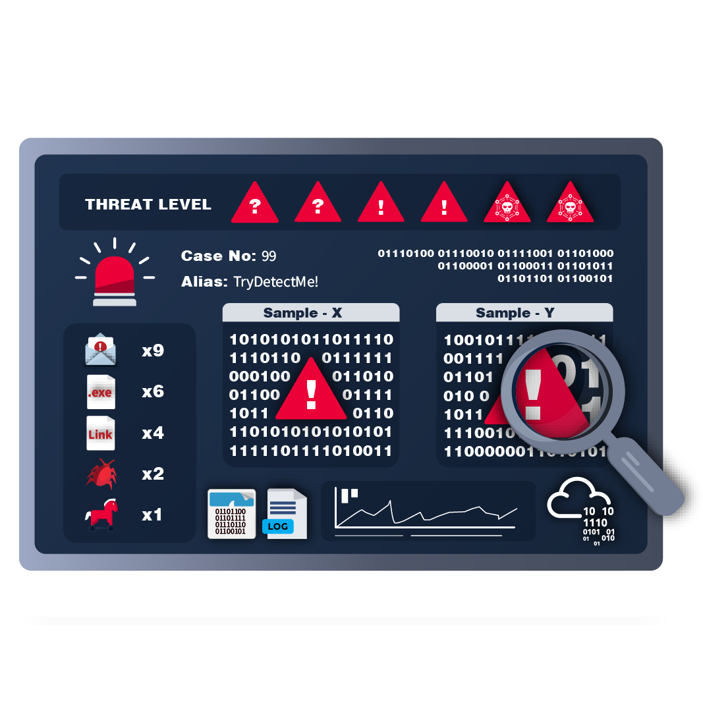
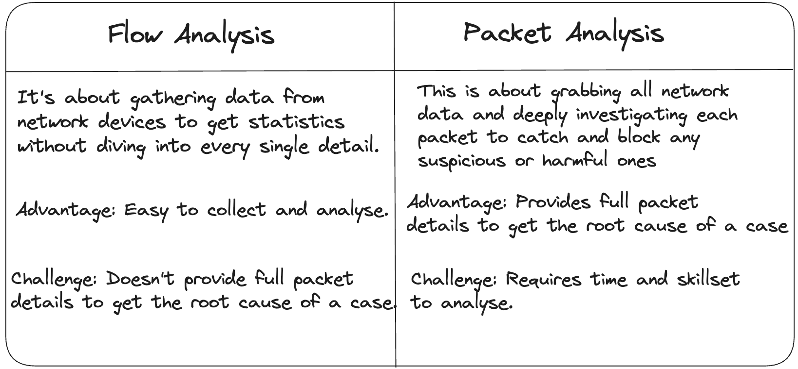

### Introduction
**Network security** means keeping the internet and computer systems safe from bad guys who try to sneak in, mess things up, or steal stuff. It's like building a strong fence around digital stuff to keep it safe from hackers and other troublemakers.

### Network Security and Network Data
#### Network Security 
- Network security focuses on two core concept that is authorisation and authentication.
- Network security operations contains 3 base control levels to ensure maximun security available management:
1. Physical
2. Technical
3. Administrative 

#### The main two approaches under base security control levels 
1. **Access controls**: It is a set of controls to ensure authentication and authorization, determining who can access the network and what actions they are permitted to perform.
2. **Threat controls**: It involves continuously monitoring the network for suspicious activities or attempted breaches to detect and neutralize potential threats, aiming to maintain the security of the network. 

#### The key elements of Access Control in network security:
- Firewall Protection
- Network Access Control (NAC)
- Identity and Access Management (IAM)
- Load Balancing 
- Network Segmentation
- Virtual Private Networks (VPN) 
- Zero Trust Model

#### The key elements of Threat Controls in network security:
- Intrusion Detection and Prevention (IDS/IPS)
- Data Loss Prevention (DLP)
- Endpoint Protection
- Cloud Security
- Security Information and Event Management (SIEM)
- Security Orchestration Automation and Response (SOAR)
- Network Traffic Analysis & Network Detection and Response

### Managed Security Services
Managed Security Services (MSS) are outsourced security services provided by Managed Security Service Providers (MSSPs). They help organizations enhance security without needing dedicated in-house teams. MSS is cost-effective, flexible, and simplifies security management. Key elements include monitoring, threat detection, incident response, and compliance assistance

####  The most common elements of MSS are:
- Network Penetration Testing
- Vulnerability Assessment
- Incident Response
- Behavioural Analysis

### Traffic Analysis
#### Traffic Analysis / Network Traffic Analysis
Traffic analysis means watching and studying how data moves around a network to spot problems or bad stuff happening. It helps keep things running smoothly and detects any sneaky or dangerous activity.

#### The two main techniques used in Traffic Analysis:

#### Benefits of the Traffic Analysis:
- Gives a clear view of the whole network.
- Helps track assets effectively.
- Helps to Detects and responds to any unusual or dangerous activities.

#### Does the Traffic Analysis Still Matter?
With more security tools and cloud use, hackers evolve to stay hidden. Even encrypted data can reveal threats through unusual patterns. That's why traffic analysis is a vital skill for security analysts.