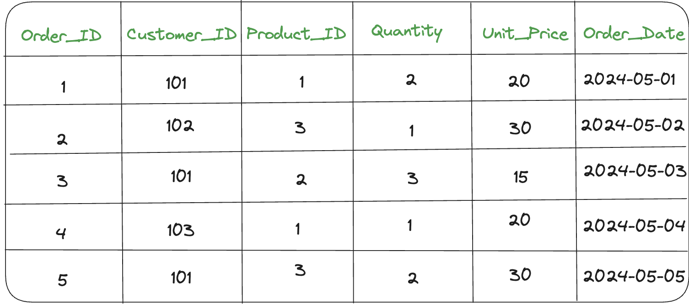
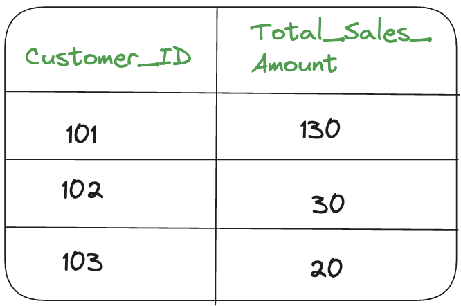

## Introduction 

In this journal, we will explore query optimization and materialized views. These concepts are essential for making our databases work faster and more efficiently. By understanding and applying these techniques, we can significantly enhance the performance and responsiveness of our database systems.

###  Advanced Query Optimization
---
**Query optimization** is the process of examining and selecting an execution strategy that minimizes the amount of resources needed to compute the query's response. Searching out an execution plan for that query in order to shorten the processing time is the primary objective of query optimization.

The two main objectives of query optimization are:
- to find the best plan for accessing the database.
- to reduce query execution time.

#### Original Query
This query uses a nested subquery to find the product with the most recent sale date. It checks each product ID against the result of the subquery, which retrieves the product ID of the sale with the maximum date. This can be slow due to the repeated evaluation of the subqueries.

        SELECT p.name, p.price
        FROM product p
        WHERE p.product_id IN (
            SELECT s.product_id
            FROM sales s
            WHERE s.sale_date = (SELECT MAX(sale_date) FROM sales)
        );

#### Optimized Query  
This version eliminates the nested subquery by using an INNER JOIN with a derived table. The derived table (latest_sale) selects the product ID of the most recent sale by ordering the sales by sale_date in descending order and limiting the result to one row. This result is then joined with the product table on product_id.  

        SELECT p.name, p.price
        FROM product p
        INNER JOIN (
            SELECT product_id
            FROM sales
            ORDER BY sale_date DESC
            LIMIT 1
        ) AS latest_sale ON p.product_id = latest_sale.product_id;

#### Components of Optimizer

- **Transformer**: It takes a parsed query, represented by query blocks, and decides if changing the query form can lower execution costs.

- **Estimator**: The Estimator determines the overall cost of an execution plan using:
    - Selectivity: Fraction of rows from a dataset.
    - Cardinality: Number of rows returned by each operation.
    - Cost: Estimated resource usage (CPU, Memory, I/O).
It factors in system resources, cardinality, and the size of the initial dataset.

- **Plan Generator**: explores different ways to execute a query block, considering various access paths, join methods, and join orders. It selects the path with the lowest cost.

#### Methods Of Query Optimization in DBMS
There are following two methods of Query Optimization in DBMS:
1. Cost Based Query Optimization in DBMS
- The optimizer gives each step of a plan a number (called cost). It adds up these costs to estimate how expensive each plan is. Then, it picks the plan that's expected to be the cheapest.

2. Adaptive Query Optimization
- the optimizer can change execution plans during runtime and gather new information to improve optimization. It's useful when existing stats aren't enough for planning.

### Materialised Views
---
A materialized view is like a saved copy of the result of a query. It's stored in the database and updated regularly. This helps speed up queries, especially when dealing with large amounts of data or complex calculations.

#### Advantages of Materilized Views 
1. Improved Performance: Queries run faster due to precomputed results.
2. Reduced Processing: Saves CPU and memory resources.
3. Simplified Queries: Complex calculations become simpler.
4. Offline Access: Data remains available even offline.
5. Scalability: Efficiently handles large data volumes and concurrent requests.

#### Example 
#### Without Materialized View
**Orders Table**

 

**Query Without Materialized View**

    SELECT Customer_ID, SUM(Quantity * Unit_Price) AS Total_Sales_Amount
    FROM Orders
    GROUP BY Customer_ID;

**Result**

#### With Materialized View
**Query Using Materialized View:**

    SELECT * FROM Total_Sales_By_Customer;

**Result**

