## DAV

### Exploring the Ip Address & website 

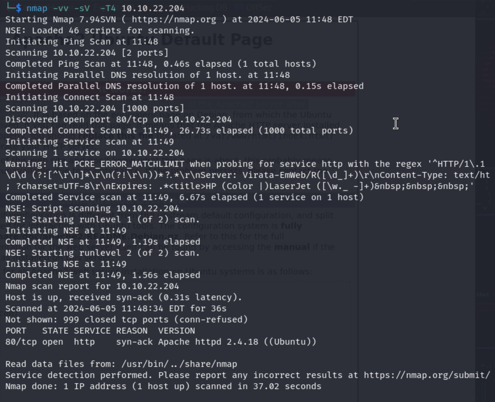

by nmaping the ip I found out that there is only 1 port opened
Fistly let's browse what's in the ip

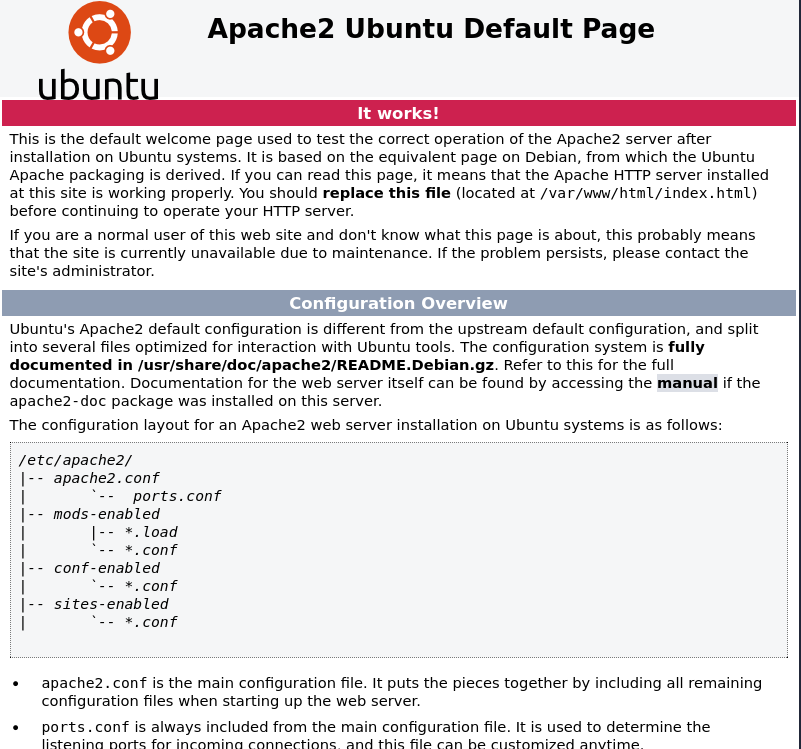

by browing the IP Address I got a page its a default welcome page used to test the correct operation of the Apache2 server after installation on Ubuntu systems.

Then I’ve checked the page source, but nothing valuable.

### Brute-forcing directories and files from the website
Now let’s find hidden dirs using gobuster.

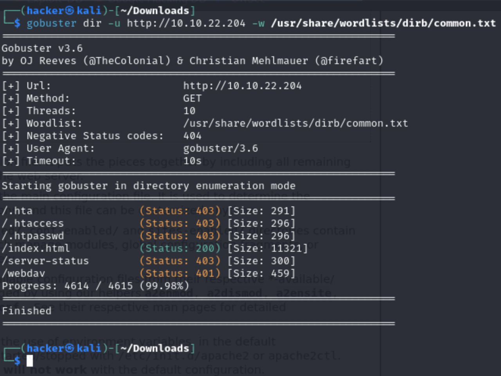

After the brutefocing the hidden directories I came across to the site **webdav** in there I have found a signin form which requires username and password.

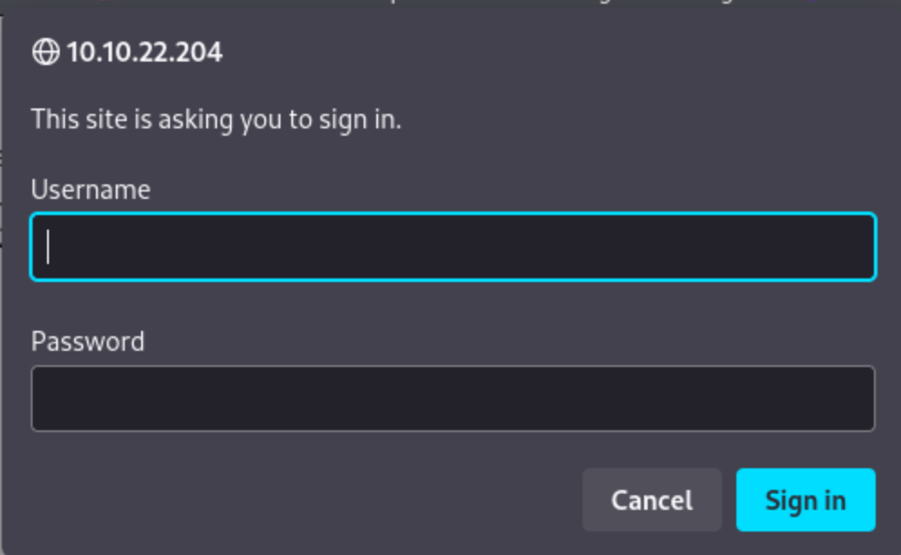

I have browse for the **webdev default  credentials** and got a username and a password from there

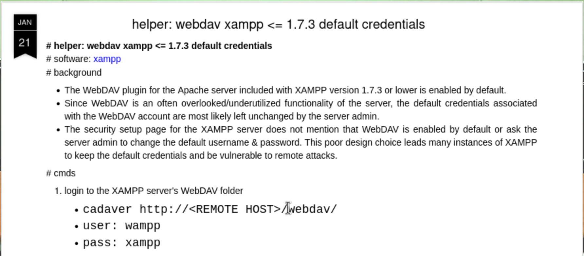

Now I have successfully log in into the site using the give default credentials.

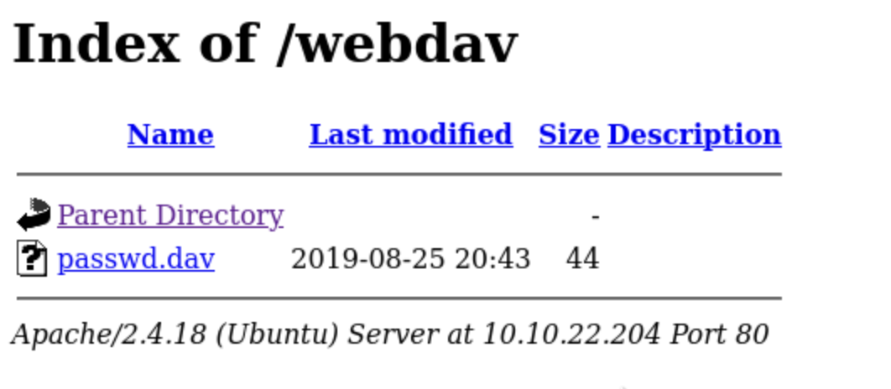

I found a file on the site, passwd.dav, which contains the username "wampp" and a hashed password.  

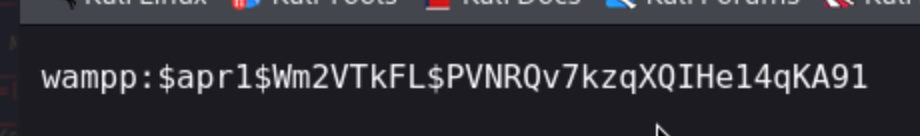

I’ve tried various ways to crack, but all of them didn’t work. So I google for webdav exploit, and found an interesting command: cadaver

### Reverse shell
Now I have decided to do a reverse shell so I search for a tool to do a reverse shell for dev. I found the **cadaver**. In here I have uploaded my php file. 

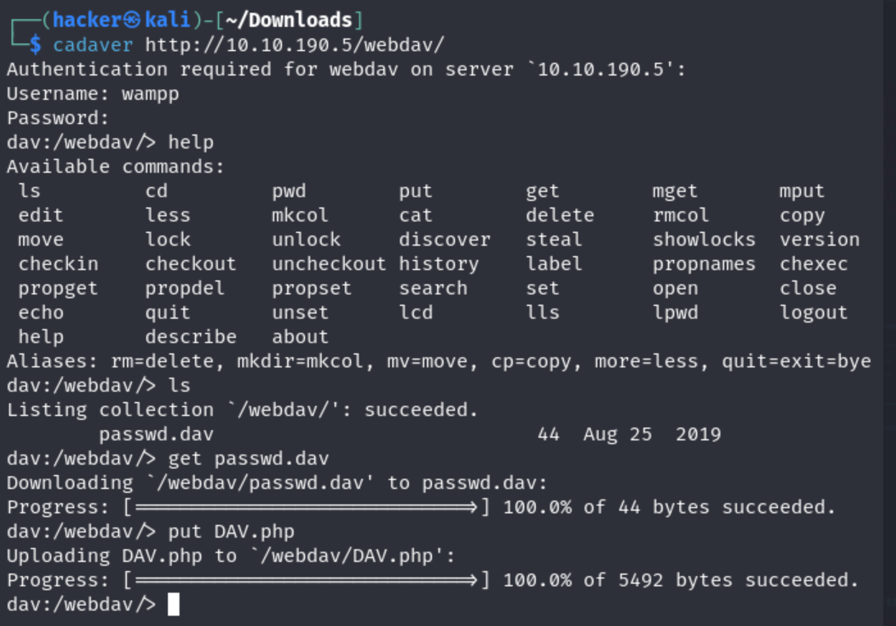

I have successfully uploaded the php file.

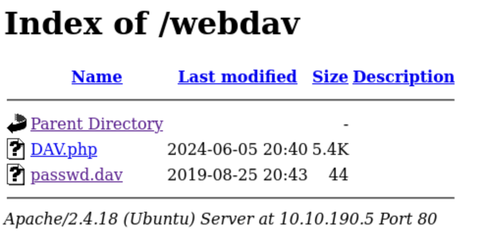

On other side I open a listener on my machine and click the shell to establish a connection.

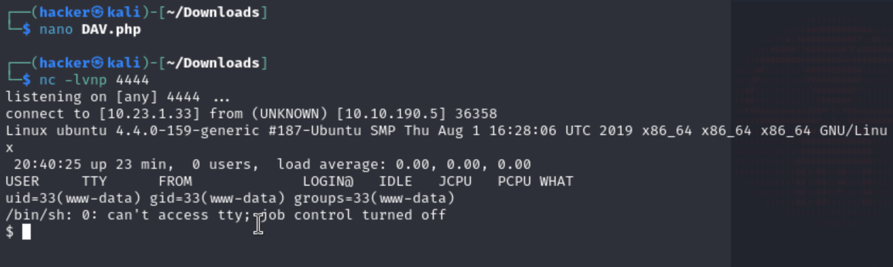 

Now I have successfully done the reverse shell.So, now let's find the user and root flag.

#### User flag

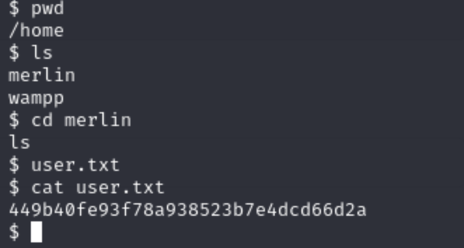 

#### Root flag

