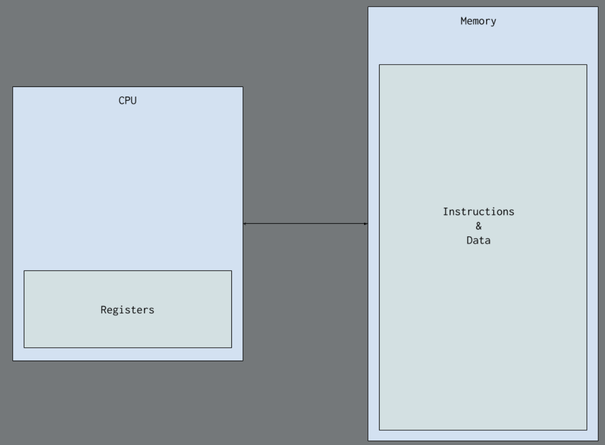

## Learning x86-64 Assembly: Part 0 - Setup and First Steps

### Introduction to x86-64 Assembly Programming
Assembly language is a low-level programming language that allows direct interaction with a computer's CPU and memory. It's a human-readable form of machine code, enabling programmers to write highly efficient and optimized programs, often used for system programming and performance-critical tasks.

### Getting the Tools
#### Assembler
- CPUs run machine code, which is hard for humans to read. Assembly language makes it readable, and an assembler converts it into machine code. There are many assemblers for x86-64, each with its own features.

- Flat Assembler (FASM) is small, easy to use, and includes useful features like a macro system and an editor.

#### Debugger
- A debugger is a tool used to test and debug programs by allowing developers to examine the program's execution

- WinDbg is being used in debugging because it is suitable for 64-bit programs, unlike OllyDbg, which is only for 32-bit.

### A 10000-foot view
CPUs can perform a fixed set of tasks known as an "instruction set." Each instruction is a simple command, like writing a value to memory or multiplying values in registers. This basic model of CPU operation helps in understanding low-level programming and debugging. High-level concepts in programming ultimately map to these simple instructions, so knowing this mapping is essential for effective low-level work.

### Registers
- Registers in x86-64 are small, fast memory locations within the CPU that provide quick access to data. Think of them as special compartments where the CPU stores and processes information. There are sixteen general-purpose registers, each capable of holding 64 bits of data.

- Registers like rax, rbx, and rcx are used for storing numbers or performing calculations.

- The rsp register keeps track of the stack, while the rip register remembers the next instruction the CPU should execute.

- The rflags register monitors different conditions during calculations.

| Register | Lower byte | Lower word | Lower dword |
|--------|-------|--------|--------|
| rax    | al    | ax     | eax    |
| rbx    | bl    | bx     | ebx    |
| rcx    | cl    | cx     | ecx    |
| rdx    | dl    | dx     | edx    |
| rsp    | spl   | sp     | esp    |
| rsi    | sil   | si     | esi    |
| rdi    | dil   | di     | edi    |
| rbp    | bpl   | bp     | ebp    |
| r8     | r8b   | r8w    | r8d    |
| r9     | r9b   | r9w    | r9d    |
| r10    | r10b  | r10w   | r10d   |
| r11    | r11b  | r11w   | r11d   |
| r12    | r12b  | r12w   | r12d   |
| r13    | r13b  | r13w   | r13d   |
| r14    | r14b  | r14w   | r14d   |
| r15    | r15b  | r15w   | r15d   |

### Memory and Addresses
Memory in a computer is like a big list of tiny storage spaces, each with a unique address. Modern systems use virtual memory, where each process has its own continuous address space managed by the OS.

In x86-64, memory is a flat array of bytes starting from 0. The OS and computer work together to give each program its own virtual address space, preventing interference.

In most computers, instructions and data are stored in the same memory (von Neumann model). Some systems, like Arduinos, use the Harvard model, where instructions and data are kept separate.

### First Program
first program in x86-64 assembly:

    format PE64 NX GUI 6.0
    entry start

    section '.text' code readable executable
    start:
            int3
            ret

#### analyzing 
- format PE64 NX GUI 6.0: Tells FASM to create a 64-bit Windows executable.
- entry start: Defines the starting point of the program.
- section ‘.text’ code readable executable: Declares a section for executable code.
- start: A label marking the entry point.
- int3: Triggers a breakpoint for debugging.
- ret: Returns to the OS, ending the program.

