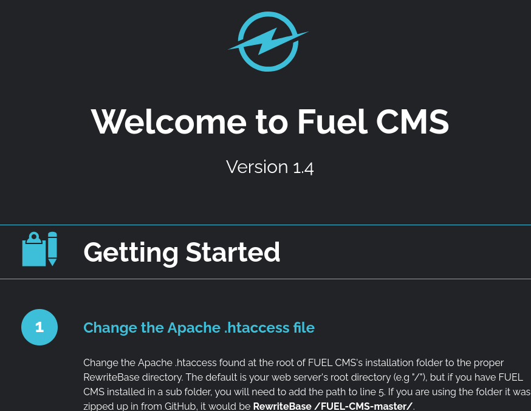
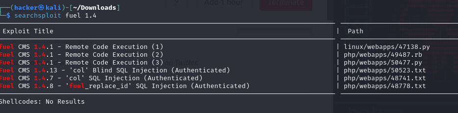
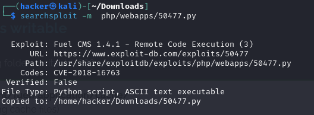
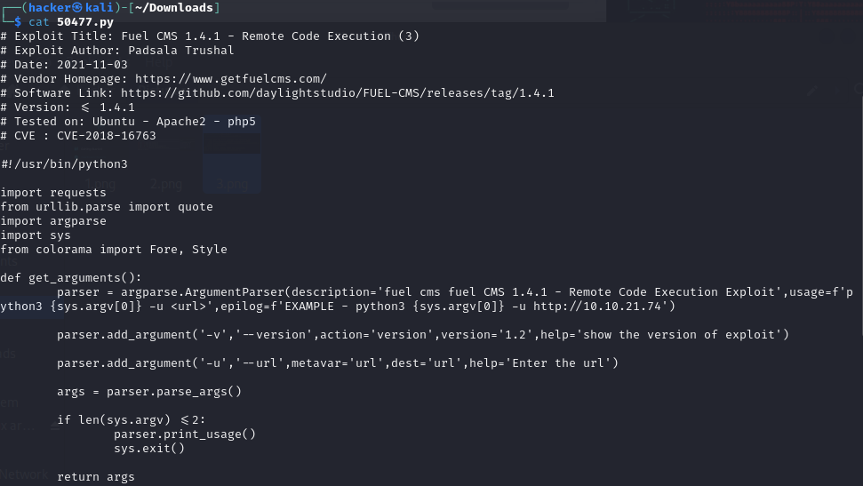
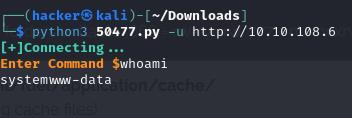
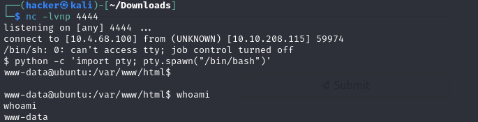
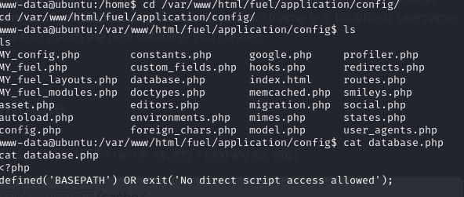
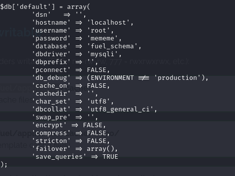
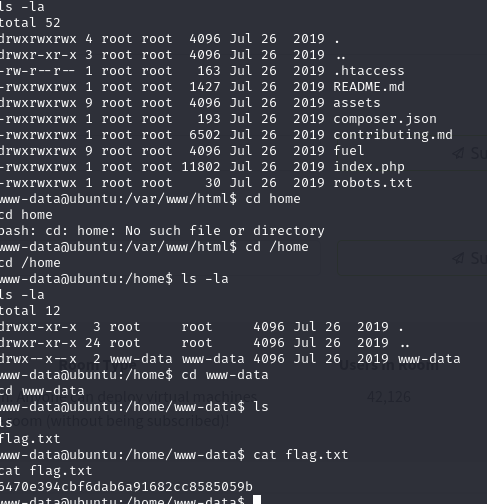
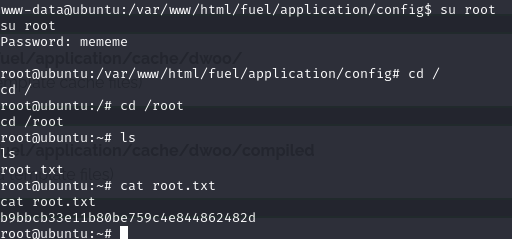

## Ignite 

**HELLO guys!**
This is a ctf journal on Ignite and i will be guiding you guys how to do this machine step by steps.

### Exploring the website
Exploring the website I have got this a Fuel CMS page with version 1.4.  I search for exploit code that I could use to gain access to the machine.

 

I used the **searchsploit** module to find the exploit code for Fuel CMS 1.4. It searches the Exploit Database — a comprehensive database of exploits, shellcode, and security vulnerabilities.

 

Then I downloaded the first python script by running the following command:

    searchsploit -m php/webapps/50477.py

 

### looking what is inside the python file 

 

Changing the Ip address in the python script I ran the python file where it opens a command prompt.

 

### Reverse Shell 
Then I will do a reverse shell by running a code that I copied from a cheetsheet that is pentest monkey.

From terminal I did netcat on port 4444 and it was successful now I can access the machine from my terminal.

 

### Rootflag
#### rootflag for user

 
 
#### Rootflag for root

**Thank you! 😊**

