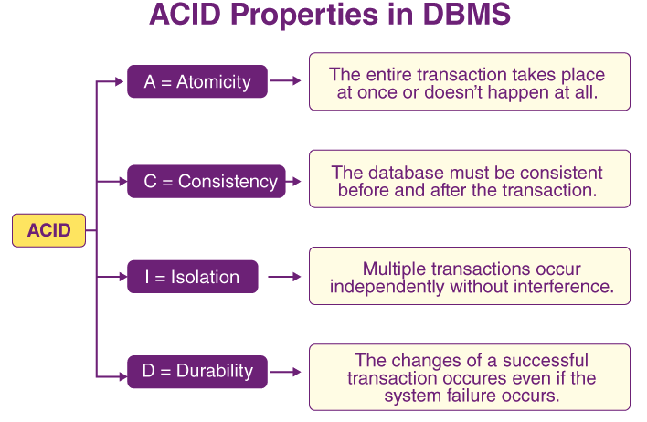
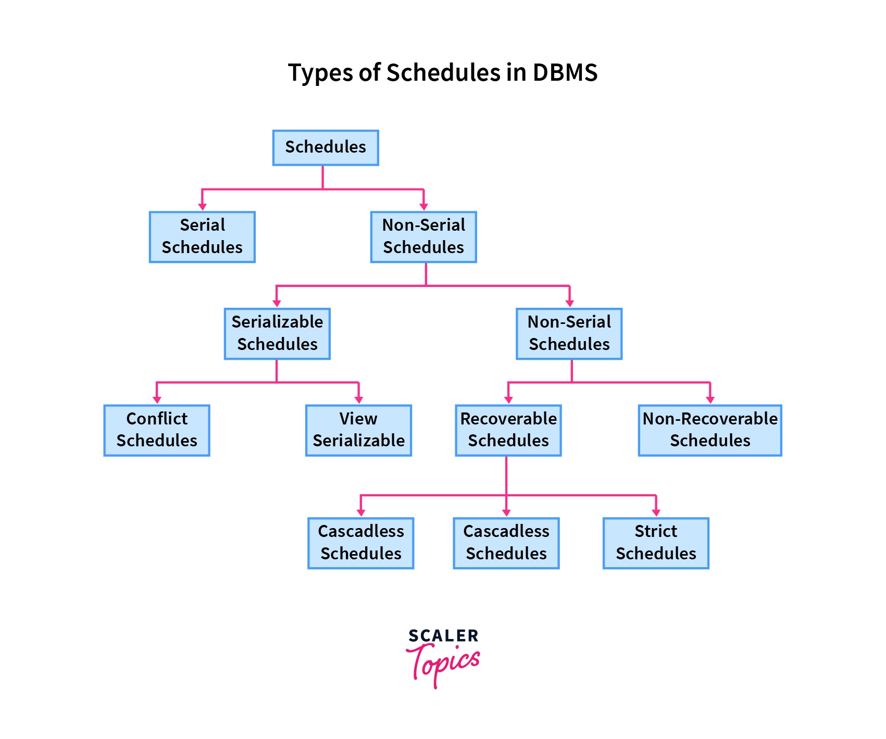
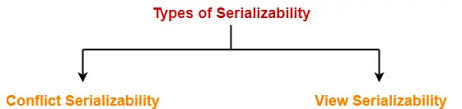
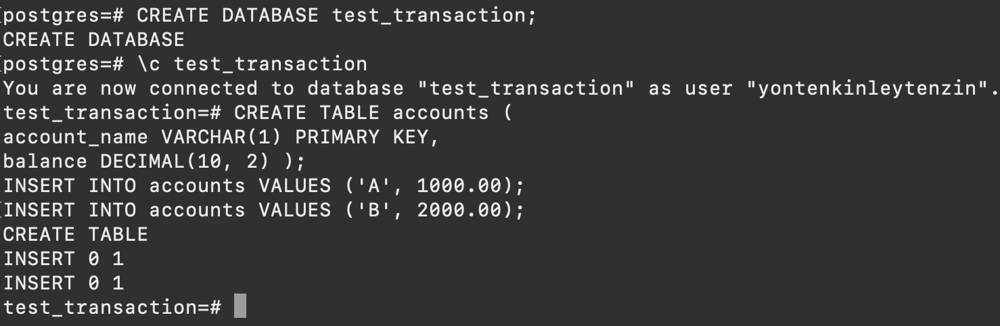

## Transactions

This journal is about database transactions. It explains how transactions maintain data reliability and consistency through ACID properties and how serializability allows multiple transactions to run simultaneously without causing errors or inconsistencies.

### Transactions in DBMS
A transaction in a database is a single, logical unit of work that involves a series of operations to access or update data.

### Transaction Properties
To maintain database consistency, it should need to follow certain properties in transactions known as the ACID.these properties ensure data reliability and integrity in databases.

1. **Atomicity:** It ensures that a transaction either fully completes or does not happen at all, preventing partial transactions. If a transaction commits, changes are saved and visible; if it aborts, changes are discarded. 

2. **Consistency:** It ensures that a database remains accurate and follows integrity constraints before and after a transaction. 

3. **Isolation:** It ensures that multiple transactions can occur concurrently without causing inconsistency. Each transaction operates independently, and changes made by a transaction are not visible to others until they are committed.

4. **Durability:** It ensures that once a transaction is completed, its changes are permanently stored, even in the event of a system failure. These updates are saved to non-volatile memory, so the effects of the transaction are never lost.

### Serializability
Serializability ensures that even when multiple transactions run concurrently, their combined outcome is equivalent to running them one after the other in a serial manner. This prevents transactions from interfering with each other and maintains database consistency.

#### Schedules and Serializable Schedules in DBMS
**Schedules** in DBMS are a series of operations performing one transaction to the other.

#### Schedules in DBMS are of two types:
1. **Serial Schedule:** A serial schedule allows only one transaction to run at a time, ensuring that each transaction finishes before the next one begins.

Example: Here, we can see that Transaction-2 starts its execution after the completion of Transaction-1.

| Transaction-1 | Transaction-2 |
|:-------------:|:-------------:|
|     R(a)      |               |
|     W(a)      |               |
|     R(b)      |               |
|     W(b)      |               |
|               |     R(b)      |
|               |     W(b)      |
|               |     R(a)      |
|               |     W(a)      |

2. **Non-serial Schedule:** In non-serial schedules, transactions overlap or run simultaneously, possibly accessing the same data. Ensuring their serializability is crucial to maintain database consistency before and after execution.

Example: We can see that Transaction-2 starts its execution before the completion of Transaction-1, and they are interchangeably working on the same data, i.e., "a" and "b".

| Transaction-1 | Transaction-2 |
|:-------------:|:-------------:|
|     R(a)      |               |
|     W(a)      |               |
|               |     R(b)      |
|               |     W(b)      |
|     R(b)      |               |
|               |     R(a)      |
|     W(b)      |               |
|               |     W(a)      |

#### Types of Serializability

1. **Conflict Serializability :** It a non-serial schedule is conflict serializable if rearranging non-conflicting operations can make it equivalent to a serial schedule.

2. **View serializability :** It is a view serializable if it produces the same results as some serial schedule.

#### View Serializability and View Serializable Schedules
A non-serial schedule is view serializable if it matches the results of some serial schedule. This ensures the schedule's consistency.

#### What is view equivalency?
- Two schedules are view-equivalent if they produce the same results on the same database state. Schedules S1 and S2 are view-equivalent if the order of any two conflicting operations is the same in both schedules.

**Two schedules S1 and S2 are said to be view-equivalent if the below conditions are satisfied :**

1) **Initial Read :** If a transaction T1 reads data item A from the database in S1 then in S2 also T1 should read A from database.

 

2) **Updated Read :** If Ti is reading A which is updated by Tj in S1 then in S2 also Ti should read A which is updated by Tj. 

3) **Final Write operation :** If a transaction T1 updated A at last in S1, then in S2 also T1 should perform final write operations. 

### what I did in Flipped Class
In our Flipped we did a simple transaction in Postgresql.I will show you step by step how to do a simple transaction.

1. I created a database named test_transaction and connected to the test_transaction database. Then Created an accounts table with columns for account names and balances.

2. Inserted two initial records into the accounts table.

3. Then I selected all records from the accounts table, then began a transaction. where first I transferred 500 units from account 'A' to account 'B' by updating their balances, and committed the transaction to save the changes. Finally, selected all records from the accounts table again to show the updated balances.

 

4. starts a transaction and deducting 100 units from the balance of account 'A'.

5. starts a transaction, adding a new account 'C' with a balance of 500 units, and then committing the transaction to save the changes.

 

6. starts a transaction and tried to update a non-existent account 'C',but encounter an error, and roll back the transaction.

 

7. Attempt to add a new account 'D' with a balance of 700 units, simulate an error, and roll back the transaction to undo the changes.

 

8. Begining a transaction, inserts a new account ‘E’ with a balance of 1000, and then commits the transaction to save the changes.

### Conclusion 
In this flipped class, we learned about how a simple transaction is done. We covered the transaction properties known as ACID properties (atomicity, consistency, isolation, durability). To ensure concurrent transactions in a database maintain consistency and produce the same results as if they were executed one after another in a serial order, we learn about serializability. We also learned about the types of serializability and serializable schedules in DBMS.

