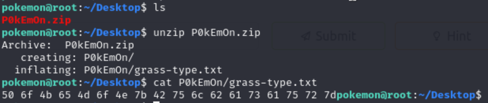
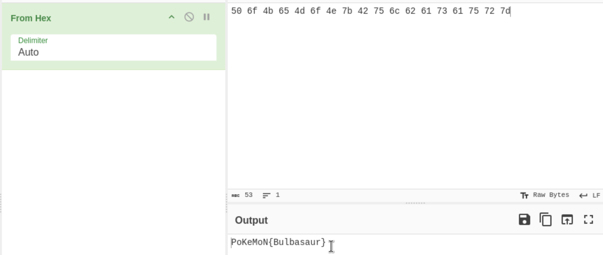
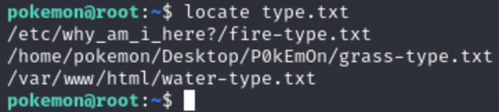
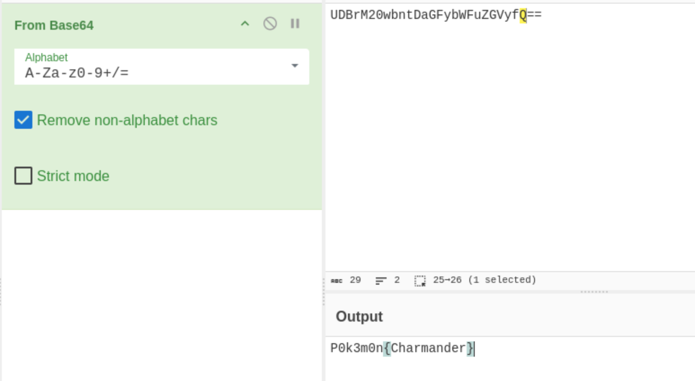
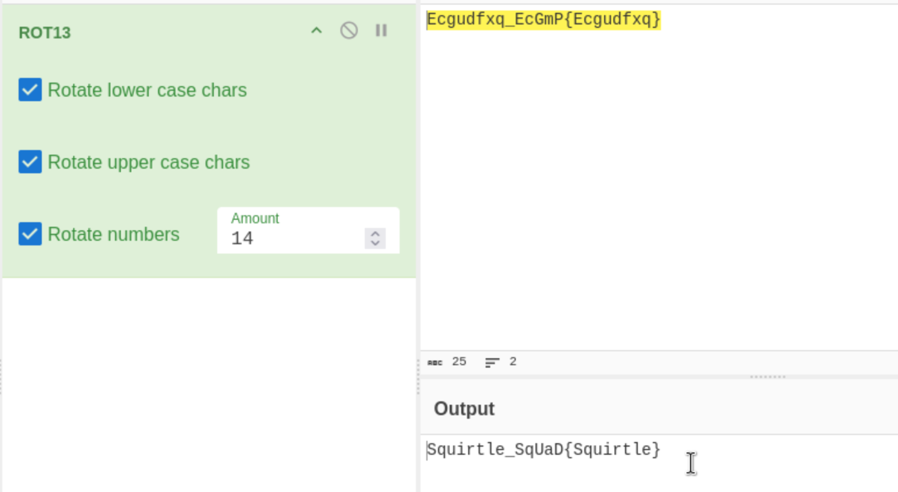
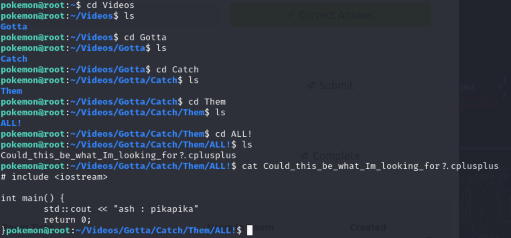
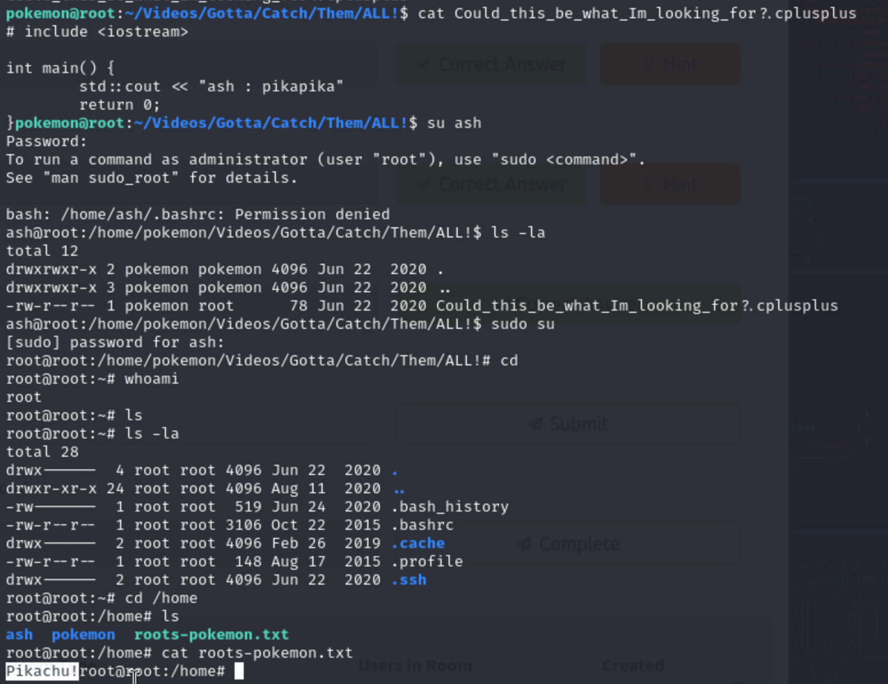

### Scaning the Ip Address

 

### Bruteforcing the hidden directories
 

### Exploring website
 

Could this be the password of shh login.Let's try **username** as pokemon and pass as **hack_the_pokemon**

It was a success.So now let's find the pokemon
 

Ohh!! there is a zip file let's unzip and see what is inside

### pokemon flags 
#### grass type 
I have got the grass type pokemon txt file. It was in a hexa decimal value so we can use the **Cyber Chef** to decode this 
 

see! we decode the code and the grass type pokemon was Bulbasaur

#### fire type
Now let's locate the other pokemon by their type.

    locate type.txt

we got the fire type pokmeon txt file 

Again let's decode it using the Cyber chef 

#### Water type
Do the same for the water type except change the recipe to **ROT13**

### Root's Favorite Pokemon
Previously we found a file called gotta under the hidden directories of videos. I let's search the root's favourite pokemon inside that.Ohh! i got somethingn it says "Could_this_be_what_Im_looking_for?.cplusplus
" let's cat that and I got username **ash** as password **pikapika**

I got into the root useing the username and password and got the root's favourite pokemon. its pikachu.

**THANK YOU**