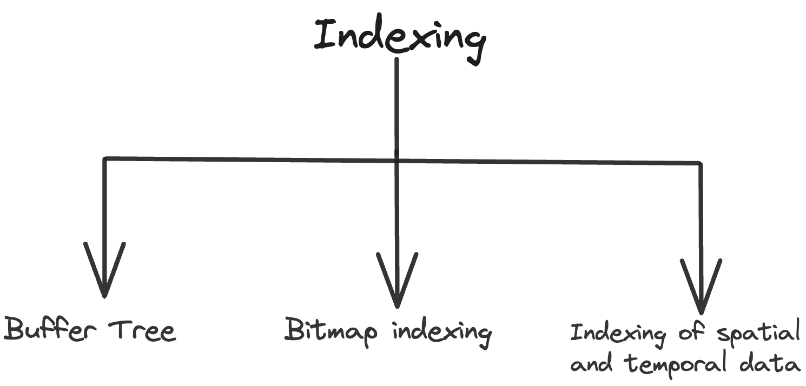
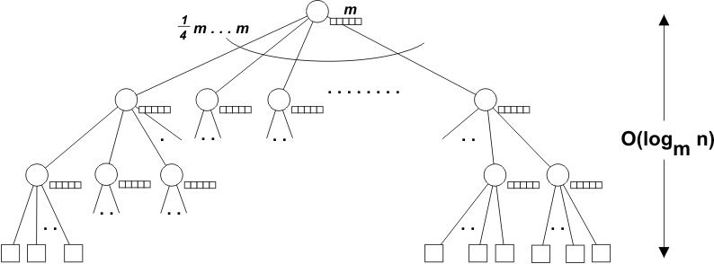
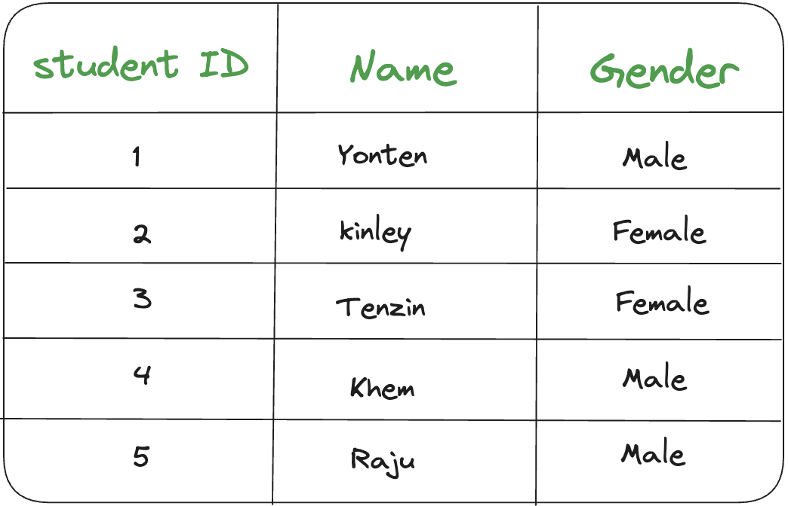
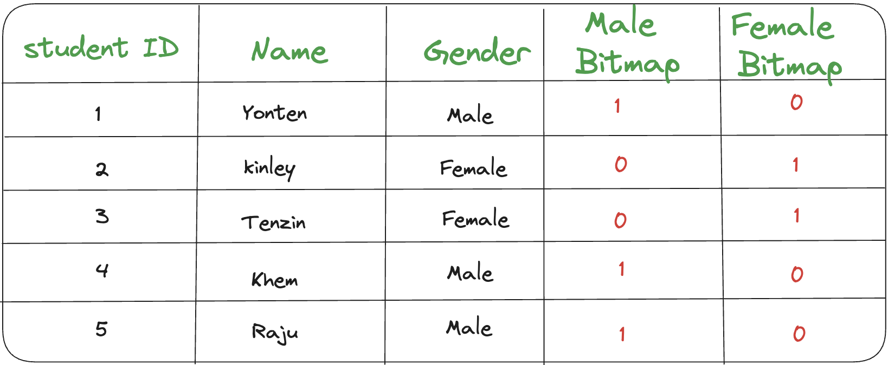

### Brief Summary of Class Activities
---
It was the best flipped class to date as it was engaging and entertaining. Firstly, we were divided int0o 6 groups by choosing pieces of paper containing lyrics of songs. The lyrics with the same songs were grouped together. Then, the topic was given to prepare; we got the buffer tree. Then we were grouped again into 2 groups. This group is the quiz group. The quizzes covered topics such as buffer tree, bitmap indexing, and the indexing of spatial and temporal data.
In this journal I would like to share my knowledge on the buffer tree,bitmap indexing and on the indexing of spatial and temporal data.

**Indexing** is a data structure technique used to locate and quickly access data in databases.

#### Types of Indexing 

### Buffer Tree 
**Buffer Tree** is a region where the disk were we write unprocessed updates, it is
widely used in databases and file systems because of their ability to efficiently store and access large amounts of data while maintaining good performance.

#### Workings of Buffer Tree 

**Organized Structure**: a buffer tree organizes data in a hierarchical structure, making it easy for the computer to find specific pieces of data.

**Quick Access**:the computer starts at the top of the tree (the root), checks certain values (keys), and follows the path down the tree to find the data it's looking for. This process is much faster than searching through every piece of data one by one.

**Balanced Structure**: a buffer tree is balanced to ensure that each part of the tree has a similar amount of data. This balance helps maintain efficiency in searching, adding, and removing data.

**Efficient Updates**: when we add or remove data from a buffer tree, the tree structure adjusts itself to remain balanced and efficient.

### Bitmap Indexing
**Bitmap indexing** is a technique used in databases to manage and improve performance of read-only queries by speeding up searches in large datasets. It works by creating a map that shows where specific data values are located in a table or column.
* E.g DIF,JPEG,PNG,etc 

* NOTE: Bitmap indexing uses 0s and 1s to represent the presence or absence of data values. 

#### How is Bitmap Indexing is done?
#### 1. Original Data:

#### 2. Bitmap Indexing:
* We create two bitmaps, one for each possible gender: "Male" and "Female."
* Each bitmap has a bit for every record in the table.
* If the student is male, the corresponding bit in the "Male" bitmap is set to 1; otherwise, it's set to 0. Similarly for the "Female" bitmap.

#### 3. Using Bitmaps for Queries:
- Suppose we want to find all male students.
- We simply look at the "Male" bitmap and find the positions where the bits are set to 1: [1, 4, 5].This tells us that students with IDs 1, 4, and 5 are male. Similarly, we can use the "Female" bitmap to find all female students.

This example demonstrates how bitmap indexing helps speed up queries by providing a quick way to locate records that meet certain criteria, such as gender in this case.

### Indexing of Spatial and Temporal Data
- Indexing of spatial and temporal data involves creating data structures that efficiently organize and retrieve information based on both location (spatial) and time (temporal) dimensions. This is crucial for applications that require querying and analyzing data that changes over time and across geographical areas, such as traffic management systems, environmental monitoring, and mobile communication networks.

#### Indexing of Spatial Data
- Spatial data mining is the process of extracting knowledge and identifying patterns from spatial data that isn't explicitly stored in spatial databases. This involves analyzing data related to location, distance, shape, and topology to uncover insights that can be applied in various fields like environmental monitoring, urban planning, and transportation.
- Spatial databases reverses spatial objects derived by spatial data. types and spatial association among such objects.
- It is the method of identifying unusual and unexplored data but useful models from spatial databases.
- Examples: Determining hotspots , Unusual locations.

#### Indexing of Temporal Data
- Temporal mining is the extraction of knowledge about occurrence of an event whether they follow Cyclic , Random ,Seasonal variations etc.
- It deals with implicit or explicit Temporal content , from large quantities of data.
- Temporal data mining comprises the subject as well as its utilization in modification of fields.
- It aims at mining new and unknown knowledge, which takes into account the temporal aspects of data. It deals with useful knowledge from temporal data.
- Examples:  
* Association Rule: "Customers who buy a laptop also buy a mouse."
* Temporal Aspect: "Customers who buy a laptop also buy a mouse within the next month."

