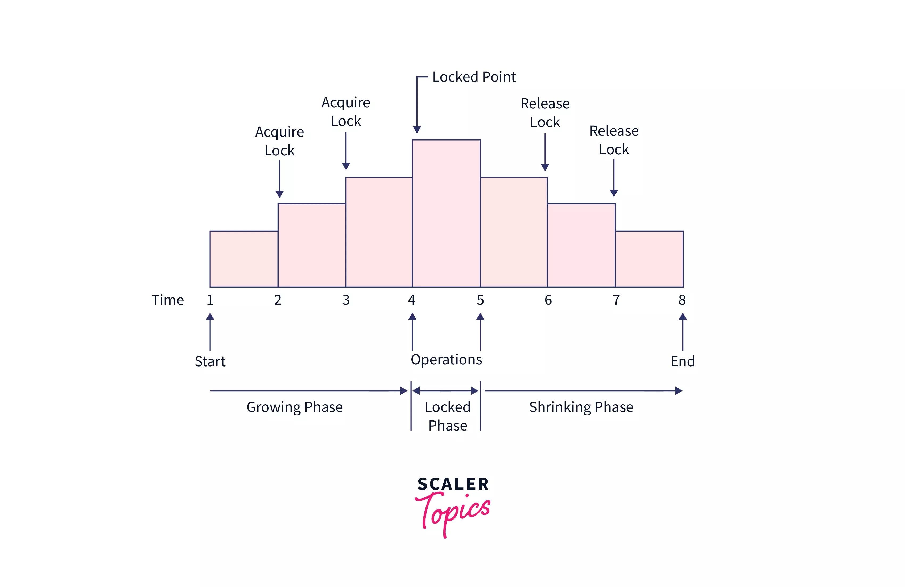

### Concurrency Control in Database Systems
- Concurrency control in database systems refers to the methods and techniques used to manage simultaneous operations on the database without causing inconsistencies.

- It ensures multiple users can access and manipulate data simultaneously without causing inconsistencies. It manages the interleaved execution of transactions to avoid conflicts and maintain data consistency, integrity, and isolation, similar to librarians updating records without interference. This improves resource utilization and throughput while preventing conflicts, such as double-booking a seat.

### Types of Concurrency Control
There are several types of concurrency control methods that can be used to manage simultaneous transactions in a database. Some of the most common types of concurrency control include:
1. Lock-based concurrency control
2. Timestamp-based concurrency control
3. Two-phase locking (2PL)

### Lock-based Concurrency Control
lock-based concurrency control (BCC) is used to control the access of multiple transactions to the same data item. This protocol helps to maintain data consistency and integrity across multiple users.

#### How Locks Work
Locks are mechanisms that restrict access to data items. When a transaction wants to read or modify a data item, it must first acquire the appropriate lock on that item. 

#### Types of Locks
1. Shared Lock (S-lock) : Shared Lock (S-lock): Allows multiple transactions to read a data item simultaneously.

2. Exclusive Lock (X-lock): Allows only one transaction to read and modify a data item at a time, preventing others from accessing it until the lock is released.

### Timestamp-based Concurrency Control
- The main goal of timestamp ordering is to guarantee serializability, which means that the order in which transactions are completed must create the same outcomes as if they were executed serially.

#### How Timestamp Ordering Works?
The timestamp ordering algorithm assigns a unique timestamp to each transaction when it arrives. This timestamp reflects the transaction's start time and helps order them for execution. The algorithm has two phases: validation and execution.

**Validation Phase:** Checks transaction timestamps to ensure proper sequence. Earlier timestamps are executed first.

**Execution Phase:** Executes transactions based on validation results. Resolves conflicts by aborting transactions with lower timestamps or delaying them until others complete.

#### Benefits of Timestamp Ordering
**Transaction Consistency:** Guaranteed by timestamp ordering method, ensuring outcomes are the same as if transactions were executed serially.

**High Concurrency:** Enabled by timestamp ordering, allowing multiple transactions to run concurrently.

**Deadlock Prevention:** Timestamp ordering method prevents deadlocks by avoiding situations where transactions wait indefinitely for each other's completion.

### Two-phase Locking (2PL)
- Two-phase locking (2PL) is a concurrency control method used in database management systems (DBMS) to ensure transaction consistency and isolation. It consists of two phases:
1. **Growing Phase:** During this phase, a transaction acquires locks on all the data items it needs for its execution but does not release any locks.

2. **Shrinking Phase:** Once all the required locks are acquired, the transaction starts releasing the locks, but it cannot acquire any new locks.

#### Illustration of Two-phase Locking (2PL)

#### Transaction implementing 2-PL.

|       |   T1 |     T2 |
|----|----|----|
| 1. | lock-S(A) |      |
| 2. | lock-S(A) |      |
| 3. | lock-X(B) |      |
| 4. | ........   | ......  |
| 5. | Unlock(A) |      |
| 6. |           | Lock-X(C) |
| 7. | Unlock(B) |      |
| 8. |           | Unlock(A) |
| 9. |          | Unlock(C) |
| 10.| ........ | ...... |

This is just a skeleton transaction that shows how unlocking and locking work with 2-PL. Note for:

**Transaction T1**
- The growing Phase is from steps 1-3
- The shrinking Phase is from steps 5-7
- Lock Point at 3

**Transaction T2**
- The growing Phase is from steps 2-6
- The shrinking Phase is from steps 8-9
- Lock Point at 6

#### Following are the most common types of Two-phase locking protocol:
- Strict two-phase locking protocols
- Rigorous two-phase locking protocols
- Conservative two-phase locking protocols

#### The advantages of the Two-Phase Locking (2PL) protocol in DBMS are:
- Guarantees serializability, ensuring data consistency.
- Prevents deadlocks by coordinating lock acquisition and release.
- Supports high concurrency for efficient transaction processing.
- Simple implementation compared to other methods.

### Lock and Latches

#### Lock
A **lock** in DBMS restricts access to data during a transaction to maintain data consistency and integrity.

There are two main types of locks that can be used in a database:

**Shared locks:** Allow multiple transactions to read a data item but prevent any transaction from writing to the data item.

**Exclusive locks:** Prevent other transactions from reading or writing to a data item.

#### Latches 

**Latches** control access to system resources in a database, ensuring transactions don't interfere with each other. They manage access to resources like memory, disk space, and CPU time. There are two main types:

**Shared latches:** Allow multiple transactions to read a resource but prevent modifications.

**Exclusive latches:** Block other transactions from accessing or modifying a resource.
