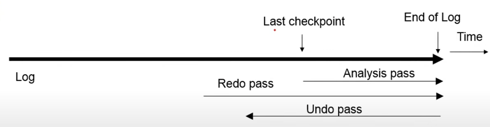
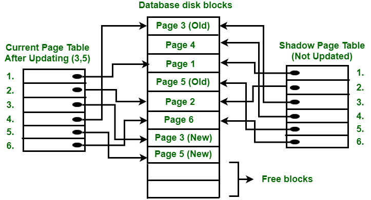

### Overview of this journal 

YOOoo! Hello guys in this journal we will explore database recovery techniques like Rollback/Undo and Commit/Redo, ensuring data integrity and consistency. We'll delve into atomic transactions, guaranteeing all operations occur or none at all, and the log-based recovery method, tracking database updates through log records.

Then, we'll explore ARIES, a recovery algorithm that speeds up recovery using Analysis, Redo, and Undo phases, along with checkpoints and Compensation Log Records (CLRs). We'll also learn about Shadow Paging, a recovery technique that maintains database consistency using two page tables.

Throughout, we'll understand the advantages of these techniques like improved fault tolerance and concurrency, balanced with challenges such as data fragmentation and performance overhead. This overview provides insights into maintaining a robust and reliable database system.

###  Recovery System
Databases can fail like any other computer system, but their data must always be available. If a database fails, it needs to recover quickly and completely. This requires atomicity, meaning transactions must be either fully completed and saved or have no effect at all.

Database recovery techniques are used in DBMS to restore a database to a consistent state after a failure. The main goal is to ensure data integrity, maintain consistency, and prevent data loss.

### Recovery Algorithms
Recovery algorithms are techniques to ensure database consistency, transaction atomicity, and durability despite failures.

like for example if I'm writing a assignment on my computer and saving my progress regularly to avoid losing work. If I make a mistake, I can hit "undo" to revert to the previous save (Undo Recovery). If my computer crashes, I reopen the assignment to restore the last saved version (Redo Recovery)

#### Types of Recovery Techniques in DBMS
**Rollback/Undo Recovery Technique:** Reverts the database to a previous state before the failure.

**Commit/Redo Recovery Technique:** Reapplies completed transactions to ensure all changes are saved.
These techniques ensure data integrity, consistency, and prevent data loss.

### Atomic Transactions
An atomic transaction is an indivisible series of database operations where either all occur, or none occur, preventing partial updates and potential issues.

This rule ensures that if you're making several changes in a transaction, like updating different parts of the database, either they all succeed or none of them do. This maintains the database's organization and consistency, with transactions recorded before execution.

### Log-Based Recovery
The atomicity property in DBMS ensures that either all transaction operations are completed or none. Changes from an aborted transaction shouldn't show, but those from a committed one should. To ensure atomicity, users first output modification details without altering the database. This helps reflect committed changes and prevent aborted transaction changes from persisting.

The log is a sequence of records tracking all database updates. Each transaction has its log. Before modifying the database, a log record is created. It includes:
- Transaction ID
- Data item
- Old value
- New value

### ARIES (Algorithms for Recovery and Isolation Exploiting Semantics)

The ARIES recovery algorithm, based on the Write Ahead Log (WAL) protocol, tracks database updates with three types of log records: Undo-only, Redo-only, and Undo-redo. Each log record is assigned a unique sequence number. Before a data page update, its corresponding log record must be written to stable storage. Checkpoint records are periodically written to log for recovery. 

The recovery process involves three phases: 
- Analysis
- Redo 
- Undo.
 
Analysis determines the starting point for recovery, Redo re-applies updates, and Undo undoes updates from incomplete transactions.

#### Three Phases of Recovery in ARIES

**Analysis Phase:** Identifies active transactions and pages needing redo or undo.

**Redo Phase:** Re-applies log changes since the last checkpoint for committed transactions.

**Undo Phase:** Undoes changes of incomplete transactions for database consistency.

**Checkpoints:** ARIES takes periodic snapshots to speed up recovery.

**Compensation Log Records (CLRs):** Tracks undo process, ensuring recovery continuity.

### Shadow Paging Recovery Technique
**Shadow Paging** is like having two copies of a book: one for reading and one as a backup. In a database, data is stored in fixed-size pages, each with a mapping in a table. During a transaction, one table is used while the other remains unchanged. After the transaction, both tables match. It's a way to ensure database consistency and is called Cut-of-Place updating.

In the above diagram two write operations are performed on pages 3 and 5. Before writing to page 3, the current page table points to the old page 3. Then, a free block is found on the disk, and page 3 is copied to that block, creating a new page 3. The current page table now points to the new page 3, while the shadow page table still points to the old page 3. The changes are then applied to the new page 3.

**Advantages**
- Requires fewer disk accesses
- Fast recovery from crashes
- Improved fault tolerance and increased concurrency
- Simple implementation and no need for log files

**Disadvantages**
- Data fragmentation and garbage accumulation
- Performance overhead during commit
- Limited concurrency control and fault tolerance
- Difficult implementation for some systems
