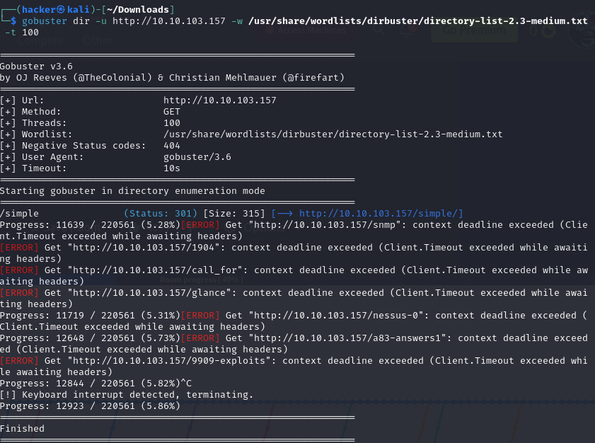

## Simple CTF

### Scanning the IP Address

 

- Three ports are open that are 21(ftp), 80(http) and 2222(EtherNetIP-1)

### EXploring the website 

 

I didn't found any important things when I browse the IP Address. Now I will bruteforce the IP and see the hidden directories.

### Bruteforcing the IP

 

After the bruteforcing I only found one website. It was a CMS page made simple page. 

### Exploring CMS Made Simple 

After the bruteforce I only found this website So, let's explore the page.

 

I got an version of this website soo let look into the Exploit DB to look at the vernuabilities in this version.

**Exploit Database** (ExploitDB) is an archive of exploits for the purpose of public security, and it explains what can be found on the database. The ExploitDB is a very useful resource for identifying possible weaknesses in yur network and for staying up to date on current attacks occurring in other networks.

