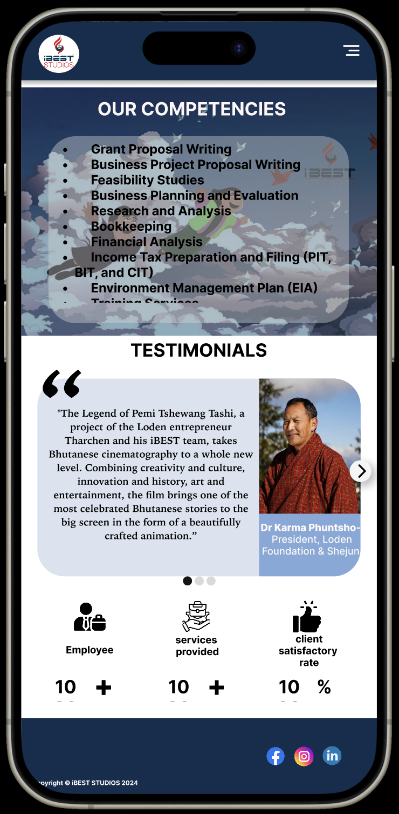
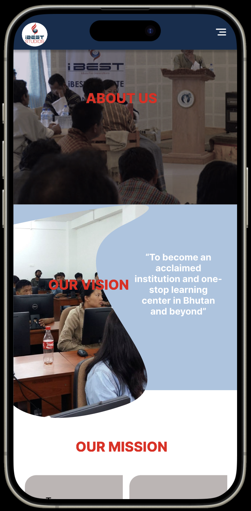

#### DATE:4/9/2024

### Brief summery of the day 

---
#### First day at intern 

Upon my arrival at iBEST Institute, I was warmly welcomed by the Operations Director, Mr. Tenzin. He guided me through the company's rules and regulations, and we signed the three-month internship contract. With a smile, he wished me luck on this exciting journey ahead.

He then introduced me to one of the software developers, Mr. Tshering Wangdi. Under his guidance, I met the rest of the software development team. The entire room buzzed with activity, filled with the energy of dedicated professionals working on iBEST's renowned project in Bhutan—Educare Skill.

Educare Skill is an innovative online education and skilling platform designed to offer the most relevant courses to help young Bhutanese excel academically and advance their careers.

Later, Mr. Tshering introduced me to the Chief Supervisor of the Software Department, Mr. Sonam Tobgay. With a welcoming demeanor, he outlined my responsibilities for the internship. My first task was to develop a new webpage for the iBEST Institute and Consultancy. To kickstart this project, he assigned me to create a website prototype using Figma, encouraging me to bring creativity and fresh ideas to the table.

##### DATE:5/9/2024
---
#### Intern Day 2
#### worked on the figma design 

Today was a bit slower in terms of progress, as I focused on mastering Figma while working on the website prototype for the institute.

My supervisor shared several documents related to the iBEST institute website, which I've been carefully reviewing to extract key information. I've been taking detailed notes and identifying essential elements to integrate into the prototype to ensure it aligns with the project's goals and vision.

A senior software developer, Tshering, introduced me to website design and the importance of matching color schemes. He recommended using resources like **Color Hunt**, **Pinterest**, and **Dribbble** for inspiration.

##### DATE:6/9/2024
---
#### Intern Day 3
---

This is my Day 3 progress. I'm currently focusing on making the prototype responsive on iPhone 14 and 15 screen sizes (393x852). By starting with a smaller screen, I can prioritize and refine the key components before adjusting for larger desktop screens.

##### DATE:7/9/2024
---
#### Intern Day 4
---

completed with the home page features and started with the about us page.

### What did I learn this week?

In my first week as an intern, I had the chance to revisit what I learned during my first semester at college, such as designing a personal portfolio. However, designing the institute's website has been an entirely different experience. Unlike a personal portfolio, this project is on a much higher level, requiring a design that grabs the attention of people across the internet.

My goal is to create a design that not only attracts visitors but also boosts the institute's popularity. To achieve this, I’ve had to evolve from designing simple portfolios to thinking like a professional UI designer, while also considering the user experience (UX) for everyone who visits the site.

To make this project successful, I explored various inspirational websites and designs. The challenges don’t stop there—I also had to familiarize myself with Figma’s components and navigation to create smooth animations and visually appealing designs.

### What are my Challanges ?

The first challenge I faced was adapting to this new environment. It's my first time experiencing a workplace where there’s no one to casually talk to, no laughter—everyone is deeply focused on their tasks.

Another challenge has been navigating Figma. Although I used it in college, this time I have to incorporate many animations and create a visually pleasing design, which requires me to browse through and watch numerous animation ideas and design tutorials.

Finding inspiration is also a challenge. There are so many well-designed websites out there, but for this institute, I need to carefully select designs that are not only creative but also appropriate for the project.